# Architecture

Research Engine separates research collection, knowledge storage, synthesis generation, and evidence review into distinct stages. Instead of feeding all scraped content into one large prompt, it stores reusable learnings and retrieves only the relevant evidence during section-based synthesis generation.

```mermaid
flowchart LR
    %% --- User Layer ---
    U[User Query<br/>+ Optional Clarifications]

    %% --- Research Layer ---
    subgraph R[Research Pipeline]
        direction LR
        R1[Query Expansion<br/>SERP Generation]
        R2[Web Research<br/>Source Collection]
        R3[Learning Extraction<br/>Structured Learnings]
    end

    %% --- Knowledge Layer ---
    subgraph K[Knowledge Layer]
        direction TB
        K1[(Learnings Database)]
        K2[(Vector Search Index)]
    end

    %% --- Synthesis Layer ---
    subgraph S[Synthesis Pipeline]
        direction LR
        S1[Section Planning<br/>Local LLM]
        S2[Retrieval per Section<br/>Relevant Learnings]
        S3[Section Writing<br/>Cited Synthesis]
    end

    %% --- Review Layer ---
    subgraph V[Interactive Review]
        direction LR
        V1[Final Report<br/>Clickable Citations]
        V2[Evidence Review<br/>Sources + Learning Text]
        V3[User Curation<br/>Pin / Exclude / Instructions]
    end

    %% --- Main Flow ---
    U --> R1
    R1 --> R2
    R2 --> R3
    R3 --> K1
    K1 --> K2
    K2 --> S1
    S1 --> S2
    S2 --> S3
    S3 --> V1
    V1 --> V2
    V2 --> V3

    %% --- Regeneration Loop ---
    V3 -. Regenerate synthesis without rerunning research .-> S1

    %% --- Styling ---
    classDef user fill:#EAF3FF,stroke:#4A90E2,stroke-width:1.5,color:#111;
    classDef research fill:#EEF7EE,stroke:#53A653,stroke-width:1.2,color:#111;
    classDef knowledge fill:#FFF8E7,stroke:#D4A72C,stroke-width:1.2,color:#111;
    classDef synthesis fill:#F3EEFF,stroke:#8A63D2,stroke-width:1.2,color:#111;
    classDef review fill:#FFF0F3,stroke:#D96C8A,stroke-width:1.2,color:#111;

    class U user;
    class R1,R2,R3 research;
    class K1,K2 knowledge;
    class S1,S2,S3 synthesis;
    class V1,V2,V3 review;
```

