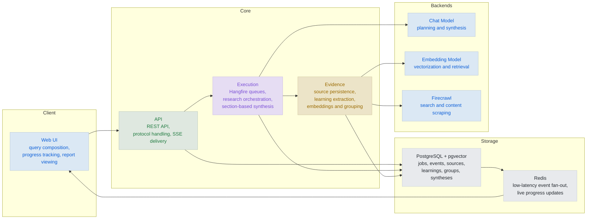
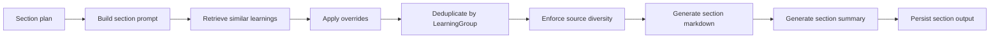
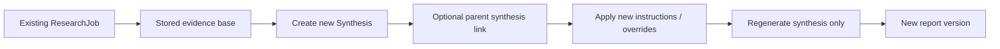

# Research Engine Architecture

> A local-first research system built around **durable evidence**.

Research Engine is designed for a simple idea: research should not disappear the moment a report is generated.

Instead of treating crawled pages as temporary prompt material, the system turns them into **structured learnings**, stores them, vectors them, groups near-duplicates, and reuses them across synthesis runs. The result is a workflow where the report is important, but the **evidence layer** is the foundation.

In practice, that means:

- sources are persisted
- extracted learnings are persisted
- embeddings are persisted
- near-duplicate learnings are grouped
- syntheses are versioned
- users can pin, exclude, review, and regenerate without repeating the crawl

So the system is not only answering a question. It is building a **job-scoped evidence base** and then generating one or more syntheses from it.

## High-level runtime view

The runtime is made up of six main parts:

1. **Web UI** — Blazor WebAssembly frontend for creating jobs, tracking progress, reading reports, and reviewing evidence.
2. **Research API** — ASP.NET Core backend that exposes the native REST API, protocol endpoints, health checks, and an OpenAI-compatible surface.
3. **Background execution** — Hangfire runs research and synthesis work outside the HTTP request lifecycle.
4. **Persistent storage** — PostgreSQL stores jobs, sources, learnings, groups, syntheses, overrides, and runtime settings. `pgvector` powers retrieval.
5. **Event streaming** — progress events are stored in PostgreSQL and published via Redis Pub/Sub for live SSE updates.
6. **External backends** — chat model, embeddings model, and Firecrawl for search and scraping.

---

## System architecture

Simply: the UI starts work and shows progress, background services build the evidence base, the synthesis service writes reports from that evidence, and PostgreSQL holds the durable state that ties the whole system together.

---

## Two pipeline phases

### 1. Research collection

The research pipeline is responsible for discovering and compressing information.

It:

- generates search queries
- applies the selected source-discovery mode
- searches and scrapes pages
- classifies and filters candidate sources for reliability
- persists sources together with discovery metadata
- extracts compact learnings
- generates embeddings
- groups near-duplicate learnings

The output of this phase is a **job-scoped evidence base**.

Source reliability is evaluated deterministically rather than delegated to the LLM. Search results and scraped pages are classified into source types such as official, government, academic, journal, preprint, news, blog, forum, and social. That metadata is used both to support per-job discovery modes (`Balanced`, `ReliableOnly`, `AcademicOnly`) and to show reliability badges and rationale in the evidence UI.

### 2. Synthesis generation

The synthesis pipeline turns that evidence base into a report.

It:

- creates a `Synthesis`
- plans report sections
- retrieves relevant learnings per section
- applies synthesis-specific overrides
- writes and stores section outputs
- assembles the final report

**This is what makes regeneration cheap**: the system usually reuses the research phase and reruns only synthesis.

---

## How the evidence layer works

`LearningIntelService` is the bridge between raw page content and reusable evidence.

It does four jobs:

- splits large content when it would exceed model context
- extracts learnings as structured statements
- generates embeddings for retrieval
- assigns near-duplicate learnings into `LearningGroup`s

The grouping is intentionally conservative. Its job is deduplication, not broad semantic clustering.

---

## How section writing works

`ReportSynthesisService` writes the report section by section rather than asking for one giant answer.

For each section it:

- builds a section-specific prompt
- retrieves similar learnings
- applies pinned and excluded overrides
- deduplicates by learning group
- enforces source diversity
- stores section markdown and summary

This keeps context pressure under control and makes the system much more practical for local models.

---

## Review, curation, and regeneration

Once a synthesis is complete, the user can:

- inspect citations and evidence
- browse sources and learnings
- pin or exclude evidence
- add new instructions or a custom outline
- create a child synthesis from the same research base

Each synthesis stores its own override state and can optionally point to a parent synthesis. That creates a clean lineage: the evidence base remains stable while the report evolves.

---

## Main runtime components

### Web UI (Blazor WebAssembly)

The frontend handles query setup, per-job source policy selection, job views, live progress, report rendering, evidence review, synthesis history, and regeneration.

### API layer (ASP.NET Core)

The backend exposes:

- **REST API** for jobs, evidence, syntheses, overrides, SSE, and runtime settings
- **Protocol API** for clarifications and structured research setup

### Background processing

Hangfire runs two main queues:

- `jobs` for research collection
- `synthesis` for report generation

### Eventing

Progress events are persisted in PostgreSQL and broadcast through Redis Pub/Sub, allowing SSE to support both replay and live updates.

### Storage

The main entities are:

- `ResearchJob`
- `Clarification`
- `ResearchEvent`
- `Source`
- `Learning`
- `LearningEmbedding`
- `LearningGroup`
- `Synthesis`
- `SynthesisSection`
- synthesis overrides
- runtime settings

---

## Why the database is central

The database is not passive storage. It is what makes the workflow durable.

It:

- stores reusable research output
- enables vector retrieval
- preserves inspectable evidence
- supports per-synthesis overrides
- enables synthesis lineage
- lets the UI reopen completed work without rebuilding everything

That is the foundation of the evidence-first workflow.

---

## Summary

Research Engine is a staged research system built around **durable evidence**.

It is optimized for:

- local-first model usage
- smaller context windows
- persistent intermediate state
- inspectable evidence and citations
- low-cost regeneration
- a user-controlled review loop
