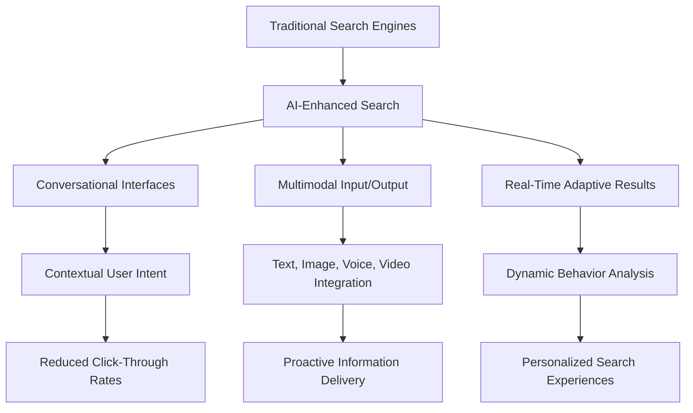

# Will AI replace the traditional search engines?

- Breadth: 4
- Depth: 3
- Created: 2026-03-24 21:23:20
- Completed: 2026-03-24 21:24:31

## Introduction

The evolution of search technologies has seen a paradigm shift with the emergence of AI-driven solutions, challenging the dominance of traditional search engines. As AI systems increasingly demonstrate capabilities in understanding context, intent, and nuance, questions arise about their potential to replace established search methodologies. This research explores whether AI, through advanced natural language processing and machine learning, can outperform conventional engines in handling complex, conversational queries, while also addressing limitations such as contextual ambiguity and multi-layered reasoning [1]. 

AI-powered search engines, such as Microsoft Bing's Copilot and Google's Gemini, highlight a trend toward personalized, proactive, and multimodal interactions. These systems not only analyze user intent but also synthesize information from diverse sources, generating cohesive answers rather than merely retrieving links [2]. Meanwhile, traditional engines face challenges in adapting to dynamic, real-time requirements, such as live data integration or cross-modal queries involving text, images, and video [3]. 

The significance of this query lies in its implications for user experience, information accessibility, and the broader AI adoption lifecycle. While AI's ability to predict intent and generate original content [2] suggests a transformative potential, questions remain about scalability, ethical considerations, and the resilience of traditional systems in specialized domains. This report synthesizes these factors to evaluate the feasibility and timeline of AI's role in reshaping search technologies.

## Evolution of Search Technologies

The evolution of search technologies reflects a progression from rudimentary information retrieval systems to sophisticated, context-aware platforms. Early search engines, such as Archie (1990) and Yahoo! Directory (1994), relied on manual categorization and keyword matching, establishing foundational principles for indexing and query processing [4]. The 1990s saw the rise of algorithmic approaches, epitomized by Google’s PageRank (1998), which introduced link analysis to rank web pages, fundamentally transforming how information was organized and accessed. This period marked the shift from static, rule-based systems to dynamic, data-driven models.

The 2010s brought advancements in natural language processing (NLP) and machine learning, enabling search engines to interpret user intent beyond literal keyword matches. Google’s Knowledge Graph (2012) and BERT (2019) exemplified this shift, incorporating semantic understanding to deliver more relevant results. By 2025, generative AI further redefined capabilities, with systems like Google’s AI Mode employing "query fan-out" techniques to decompose complex queries into subtopics, while tools such as Perplexity AI and You.com integrated real-time data and multimodal support (text, images, video) to address evolving user needs [3], [3]. These innovations highlight a trajectory where AI enhances rather than replaces traditional frameworks, augmenting capabilities like behavioral adaptation [5] and proactive suggestion [5].

A key trend is the coexistence of specialized tools, with users leveraging Perplexity for depth, Exa for speed, and Google for commercial queries, indicating a multi-tool ecosystem rather than a singular replacement [6]. This suggests that while AI-driven search engines expand functional boundaries, traditional systems remain relevant through complementary roles. The future appears to favor integration, where AI enhances existing infrastructures rather than supplanting them, as seen in hybrid models combining blockchain privacy (Brave Search) [7] with real-time data analytics.

## Rise of AI in Search

Artificial intelligence has significantly transformed search processes, enabling more intuitive, context-aware, and efficient interactions. Modern AI-powered search systems leverage natural language processing (NLP), machine learning, and real-time data integration to understand user intent, process complex queries, and deliver proactive insights. For instance, Google’s Gemini AI facilitates conversational search with multi-step reasoning, while Microsoft Bing’s Copilot AI offers natural language answers, visual search, and Office 365 integration [7][7]. These systems move beyond traditional keyword matching, using machine learning to predict user needs and generate contextually relevant responses [2].  

The integration of AI has also introduced multimodal capabilities, combining text, images, voice, and video to create seamless user experiences. For example, AI-powered search engines now support real-time video analysis and augmented reality (AR) integration, expanding the scope of what users can achieve through search [3]. Additionally, AI-driven systems like ChatGPT Search excel in contextual understanding, allowing for conversational follow-ups and deep reasoning over static link-based results [4].  

While AI enhances search accuracy and efficiency, it does not entirely replace traditional search engines. Instead, AI Overviews and features like Google’s AI Mode increasingly coexist with conventional search result pages (SERPs), appearing alongside related searches and "People Also Ask" sections. This hybrid approach suggests integration rather than disruption, with AI augmenting rather than eliminating established search paradigms [8].  

The shift toward AI-driven search has also altered user behavior, with individuals posing more complex, multi-faceted questions and relying on AI to synthesize information. For example, Google’s Deep Search feature can execute hundreds of simultaneous searches to generate expert-level, fully-cited reports, revolutionizing research workflows [9]. As AI continues to evolve, its role in search will likely expand, blending seamlessly with traditional systems to create a more adaptive and user-centric experience.

## Capabilities and Limitations of AI in Search

AI-driven search systems demonstrate significant advancements in handling complex, context-sensitive, and conversational queries by leveraging semantic analysis and natural language processing. Unlike traditional engines that rely on keyword matching, AI systems like Google's Gemini and Microsoft Bing's Copilot can interpret user intent, perform multi-step reasoning, and generate dynamic responses tailored to specific contexts [7], [7]. These systems excel in tasks such as synthesizing information from diverse sources, generating original content, and adapting results based on user behavior patterns [2], [2].  

However, AI's current capabilities remain constrained by reliance on existing data ecosystems and computational resources. While GenAI search engines can process queries faster and offer proactive suggestions, their effectiveness depends on real-time web crawling infrastructure and access to up-to-date information [2]. Traditional search engines still maintain advantages in specialized domains requiring strict data governance or legacy system compatibility. The integration of multimodal capabilities—combining text, images, and real-time video analysis—represents a next frontier for AI search, but implementation remains limited to early adopter platforms [3].  

A critical distinction lies in the ability to generate original content versus retrieving pre-existing data. While AI systems can create synthesized answers, they often lack the exhaustive, source-verified depth of traditional search results in academic or technical fields [2]. This suggests AI is more likely to augment rather than fully replace traditional search engines in the near term, particularly in scenarios requiring precise, citation-driven information.

## Case Studies and Real-World Applications

AI-driven search solutions are reshaping user interactions and challenging traditional search paradigms through enhanced contextual understanding, predictive capabilities, and multimodal integration. Case studies highlight both disruptive innovations and collaborative advancements:  

- **Google's Gemini AI** demonstrates conversational search with multi-step reasoning, improving user intent understanding while coexisting with traditional search results. Its AI Overviews feature reduces click-through rates on standard links by 58%, yet integrates with SERP elements like "People Also Ask" [2].  
- **ChatGPT Search** excels in contextual follow-ups and deep reasoning, offering a conversational interface that contrasts with traditional keyword-based models. However, users still rely on multiple tools—e.g., Perplexity for depth, Exa for speed, and Google for commercial queries—indicating a fragmented ecosystem rather than a singular replacement [6].  
- **Perplexity AI** focuses on factual, educational search with real-time citations, while **Brave Search** combines AI with blockchain principles for privacy-focused results. Both reflect niche applications rather than broad displacement of traditional engines.  

AI's impact extends beyond standalone tools:  
- **Multimodal capabilities** are emerging, with systems like Google's Deep Search handling text, images, voice, and video simultaneously. This shifts user behavior toward complex, multimodal queries [3].  
- **Dynamic adaptation** via AI-driven user behavior analysis allows personalized result adjustments, though traditional engines remain critical for commercial and localized searches.  

While AI enhances efficiency and context-awareness, current evidence suggests integration rather than replacement. Traditional search engines retain dominance in specific use cases, and users adopt hybrid workflows. The evolution appears to be toward complementary systems rather than a binary replacement scenario.

## Future Projections and Trends

The integration of AI into search technologies is reshaping how users interact with information, with predictions pointing toward a future where AI enhances rather than replaces traditional search engines. Current trends indicate that AI-driven search engines are moving beyond simple query-response mechanisms to offer contextual understanding, predictive capabilities, and multimodal interactions. For example, Google’s AI Overviews technology now provides AI-generated summaries to 58% of users, reducing reliance on traditional search result links [2]. This shift reflects a broader trend where AI anticipates user intent, as seen in systems like Google’s Gemini, which enables conversational search with multi-step reasoning [7].

Key developments in AI-powered search include the rise of multimodal capabilities, where text, images, voice, and video are processed simultaneously. By 2025, search engines are expected to support real-time video analysis and augmented reality (AR) integration, creating seamless hybrid experiences [3]. Additionally, AI’s ability to analyze user behavior dynamically adapts search results, as noted in studies highlighting its role in optimizing content for context-aware retrieval [5]. However, traditional search engines are not being displaced; instead, they are evolving to incorporate AI features. For instance, Bing and Google have integrated AI Overviews and Search Generative Experience (SGE), which have helped stabilize traffic despite the rise of chatbot platforms [10].

A critical debate centers on whether AI will supplant traditional search paradigms. While some argue that AI’s contextual reasoning and conversational interfaces could diminish the need for conventional keyword-based searches, others emphasize the complementary relationship. AI Overviews, for example, frequently appear alongside traditional SERP elements like “People Also Ask” and related searches, suggesting integration rather than replacement [8]. Future projections also highlight AI’s role in real-time information delivery, such as live updates for traffic or breaking news, which could further blur the lines between search and proactive information systems [3].

Despite these advancements, challenges remain. AI’s reliance on vast datasets and computational power raises concerns about accessibility and bias, while its integration with traditional systems requires careful balancing of user control and automation. As of 2025, the consensus leans toward coexistence, with AI augmenting rather than eliminating the need for structured, keyword-driven search.

## Conclusion

**Conclusion**  
The emergence of AI in search technologies underscores a transformative shift rather than a replacement of traditional search engines. While AI excels in handling complex, context-sensitive queries through natural language processing, multimodal interactions, and proactive insights, it complements rather than supersedes conventional systems. Traditional engines remain vital for precision, structured data retrieval, and specialized domains requiring strict data governance, whereas AI enhances user experience by addressing nuanced, multi-faceted requests. The coexistence of both paradigms is driven by economic viability, as hybrid models—such as Google’s AI Mode or Brave Search—leverage AI’s adaptability while retaining the reliability of established frameworks. Key trade-offs include AI’s limitations in real-time data integration and domain-specific accuracy, contrasted with traditional systems’ strengths in citation-driven precision and commercial query efficiency. Future trends indicate a dynamic equilibrium, where AI’s evolution hinges on overcoming contextual ambiguity and scalability challenges, while traditional engines adapt through incremental AI integration. Ultimately, the search landscape will likely remain a hybrid ecosystem, shaped by user behavior, technological progress, and the complementary strengths of AI and conventional methodologies.

## Sources

1. https://www.techtimes.com/articles/313049/20251129/ai-search-engines-vs-traditional-search-2025-comparison-whats-driving-winners.htm
2. https://www.techtarget.com/WhatIs/feature/GenAI-search-vs-traditional-search-engines-How-they-differ
3. https://weventure.de/en/blog/ai-search-2025
4. https://digitalguider.com/blog/top-ai-search-engines/
5. https://ttms.com/llm-powered-search-vs-traditional-search-2025-2030-forecast/
6. https://www.reddit.com/r/ArtificialInteligence/comments/1miwru7/search_engines_that_are_actually_usable_in_2025/
7. https://industrywired.com/artificial-intelligence/smarter-search-top-ai-powered-search-engines-of-2025-9006515
8. https://www.semrush.com/blog/semrush-ai-overviews-study/
9. https://blog.google/products-and-platforms/products/search/google-search-ai-mode-update/
10. https://onelittleweb.com/data-studies/ai-chatbots-vs-search-engines/