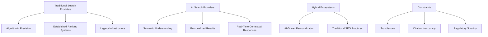

# Will AI search replace the traditional search engines?

- Breadth: 4
- Depth: 3
- Created: 2026-04-05 10:59:12
- Completed: 2026-04-05 11:00:30
- Sources: Balanced

## Market Dynamics and Competitive Pressures

The search engine industry is undergoing significant transformation as AI technologies challenge established paradigms, creating both opportunities and pressures for traditional players. Market dynamics reflect a shift toward AI-driven search solutions, though traditional engines maintain resilience in specific use cases. Key trends and competitive pressures include:

1. **Technological Divergence**:  
   Traditional search engines rely on algorithmic, keyword-based ranking systems (e.g., keyword frequency, backlinks) [1], while AI-powered systems employ probabilistic models to analyze semantic context and user intent [2]. This shift enables AI search to deliver more personalized results by interpreting query context rather than relying solely on literal keyword matches [2].

2. **Market Growth and Disruption**:  
   The AI search engine market is expanding rapidly, driven by advancements in natural language processing (NLP) and machine learning. By 2025, the NLP segment alone is leading growth, with applications in improving search relevance across industries [3]. Companies like Meta are developing AI-based search tools to reduce dependency on traditional platforms, integrating them with AI assistants for real-time, contextual responses [3].

3. **Competitive Pressures and Hybrid Models**:  
   While AI search demonstrates superiority in complex query understanding and personalization, traditional engines remain dominant in areas requiring precise, deterministic outcomes. For instance, local searches retain strong click-through rates due to the need for specific business information that AI summaries may not fully address [4]. Analysts predict a convergence of technologies, where AI and traditional methods serve complementary roles in the user journey, requiring businesses to adapt both strategies for optimal visibility [4].

4. **Limitations and Uncertainties**:  
   Current evidence highlights the evolving nature of this competition. While AI search shows promise in reducing irrelevant results and enhancing precision [5], its long-term viability depends on overcoming challenges like contextual accuracy and integration with legacy systems. Additionally, the lack of high-trust primary sources underscores the need for caution in interpreting claims about AI's disruptive potential [6].

This dynamic landscape suggests that the search industry is not experiencing a binary replacement of traditional engines by AI but rather a complex interplay of innovation, adaptation, and niche specialization. The pace of change remains uncertain, with AI's role likely to evolve through iterative improvements rather than immediate disruption.

## Technological Capabilities and Limitations of AI Search

AI search systems demonstrate distinct technological capabilities compared to traditional search engines, but their limitations remain significant. Traditional engines rely on algorithmic, deterministic methods such as keyword frequency, backlinks, and metadata for ranking, while AI search employs probabilistic models trained on vast datasets to interpret context and user intent [1]. This enables AI to deliver semantically relevant results, reducing irrelevant outputs through natural language processing [2], though sources note inconsistent accuracy in citation tracking, with 30%–50% of AI-generated citations potentially unsupported [7].

Technical constraints include high computational demands, limiting scalability for large-scale applications where traditional engines remain more viable [8]. AI systems also exhibit risks of bias from training data, potentially leading to unfair outcomes that traditional engines may avoid [8], though this remains contested in low-trust sources. While AI enhances precision through semantic ranking [5], users face increased verification burdens, as fact-checking AI responses often takes longer than independent research via traditional methods [7].

Hybrid approaches, such as Azure AI Search combining keyword, vector, and semantic ranking, aim to bridge gaps, but limitations persist in areas like local business queries, where traditional engines maintain stability due to specific information needs [4]. Both systems share dependencies on structured data and content optimization [1], yet AI's contextual understanding remains uneven, with some sources highlighting its inability to fully replace traditional search for localized or highly specific queries.

## User Behavior and Adoption Incentives

User behavior and adoption incentives for AI search versus traditional engines reveal a complex interplay of preference, habit, and perceived value. While AI search engines emphasize personalization and contextual understanding, traditional engines remain deeply entrenched due to established user trust and traffic dominance. Key factors influencing adoption include:  

- **Personalization vs. Verification Burden**: AI search engines offer tailored results by analyzing user behavior, location, and history, which can enhance relevance [2]. However, users often face increased verification challenges, as fact-checking AI-generated responses requires additional effort compared to traditional keyword-based searches [7].  

- **Traffic and Habit Persistence**: Traditional search engines like Google continue to dominate traffic, with one source noting that Google sends 345 times more traffic than all AI platforms combined, and 96.98% of clicks occur in the top 10 traditional search results [4]. This reflects entrenched user habits and the perceived reliability of established engines.  

- **Contextual Utility and Limitations**: AI search excels in scenarios requiring semantic understanding, such as natural language queries or complex problem-solving, but struggles with tasks demanding precise, factual verification. Local searches, for instance, remain strongly tied to traditional engines due to the need for specific, real-time business information that AI summaries may not fully address [4].  

- **Convergence as a Trend**: Some evidence suggests that AI and traditional search may not replace each other but instead serve complementary roles. For example, optimizing content for traditional search (e.g., structured data, schema markup) also benefits AI search, as both rely on similar structural elements [1]. This implies that user adoption may depend on how well platforms integrate both approaches.  

Overall, adoption hinges on balancing AI’s contextual strengths with traditional engines’ reliability and familiarity. However, low-trust sources dominate the evidence, highlighting the need for caution in interpreting these trends [4].

## Provider and Ecosystem Incentives

Search engine providers and ecosystem stakeholders face divergent incentives and constraints as AI search evolves. Traditional providers like Google prioritize maintaining dominance through algorithmic precision and established ranking systems, while AI-driven platforms emphasize personalization and semantic understanding. These competing priorities shape strategic investments and ecosystem partnerships.  

Key incentives driving AI search adoption include:  
- **Enhanced personalization**: AI systems adapt results to user behavior, location, and history, offering tailored experiences [2].  
- **Semantic accuracy**: Models like Azure AI Search use vector-based methods to identify context-aware relevance, improving query interpretation [5].  
- **Ecosystem integration**: Companies like Meta develop proprietary AI search to reduce reliance on traditional engines, embedding it into broader service ecosystems [3].  

However, constraints persist:  
- **Trust and bias**: AI systems risk unfair outcomes due to flawed training data, a challenge traditional engines may mitigate through deterministic algorithms [8].  
- **Citation reliability**: AI tools often cite sources that lack substantive support, undermining transparency [7].  
- **Hybrid dependencies**: Even AI systems rely on traditional search optimization practices, such as structured data and schema markup, to ensure visibility [1].  

Ecosystem stakeholders, including content creators and advertisers, must navigate these shifts. While AI promises deeper user engagement, traditional engines retain stability in localized queries and established trust metrics. The interplay between these models suggests a coexistence rather than a clear replacement, with providers balancing innovation against legacy infrastructure constraints.  

## Regulatory and Ethical Considerations

The integration of AI search technologies faces significant regulatory and ethical scrutiny, shaped by concerns around transparency, bias, privacy, and accountability. These factors influence both adoption rates and the policy frameworks governing their use.  

**Transparency and Accountability**  
AI search systems often lack sufficient transparency, with studies indicating that 30–50% of citations in AI-generated responses are inaccurate or unsupported [7]. This undermines trust in AI-driven search results, as users cannot verify the reliability of sources. While some platforms, like Microsoft Azure AI Search, emphasize responsible AI practices—such as bias mitigation and compliance in semantic ranking—these efforts remain peripheral to broader systemic challenges [5]. Research highlights that transparency in AI algorithms is more effective as a "peripheral cue" for organizational trust than a core factor in system trust [9], suggesting that technical fixes alone may not address user skepticism.  

**Privacy and Data Security**  
The rise of AI search has intensified privacy concerns, particularly around data tracking and local processing. Privacy-first engines like Brave Search and Perplexity AI have gained traction due to user demand for reduced surveillance, but their adoption remains limited by technical and infrastructural constraints [2]. Users are advised to enable anonymous browsing modes and avoid sensitive queries, yet these measures are not universally implemented across AI search tools [2]. Regulatory frameworks, such as GDPR and CCPA, may increasingly require AI search providers to adopt stricter data-handling policies, potentially shaping their market viability.  

**Bias and Fairness**  
AI search systems risk perpetuating biases present in their training data, leading to skewed or unfair outcomes. For instance, 36% of cited sources in AI responses are not actually used in generating answers, creating a misleading impression of thoroughness [7]. This opacity exacerbates concerns about algorithmic fairness, particularly in domains like healthcare or legal research where accuracy is critical. While companies like Meta have developed AI-based search engines to reduce reliance on traditional platforms, their ability to address systemic bias remains unproven [3].  

**Regulatory and Policy Challenges**  
Current regulations often lag behind the rapid evolution of AI search technologies. For example, the lack of standardized guidelines for source attribution, confidence scoring, or explainable AI (XAI) techniques leaves gaps in accountability [10]. Policymakers face the challenge of balancing innovation with safeguards against misuse, such as misinformation or surveillance. Additionally, the coexistence of traditional and AI-driven search may require hybrid regulatory approaches, ensuring that legacy systems are not entirely displaced without addressing their limitations.  

In sum, while AI search offers efficiency gains, its adoption hinges on resolving these regulatory and ethical dilemmas. The interplay between transparency, privacy, bias, and policy will determine whether it complements or supersedes traditional search engines.

## System-Level Constraints and Integration Challenges

System-level integration of AI search with existing infrastructure faces significant technical and operational hurdles. Traditional search engines rely on deterministic algorithms for indexing and ranking, while AI systems employ probabilistic models requiring substantial computational resources [1]. This fundamental architectural difference creates compatibility challenges, particularly with legacy systems designed for keyword-based retrieval rather than semantic understanding [2].  

A critical constraint is the computational cost of AI search, which demands specialized hardware and energy-efficient architectures to handle real-time processing of semantic queries [8]. Traditional engines, in contrast, operate effectively on conventional server infrastructures, making them more scalable for large-scale deployments. This disparity is compounded by the need for hybrid systems that combine both approaches, as seen in Azure AI Search's integration of keyword, vector, and semantic ranking methods [5].  

Reliability remains a contentious issue. AI search tools frequently cite sources that do not substantiate their claims, with 30-50% of citations being inaccurate [7]. This undermines trust in AI-generated results, particularly for critical information retrieval. Additionally, AI systems exhibit bias from flawed training data, potentially leading to unfair outcomes that traditional engines might mitigate through transparent, rule-based algorithms [8].  

Despite these challenges, AI search demonstrates value in contextual understanding, reducing irrelevant results through semantic analysis [2]. However, local search scenarios—where users require specific, location-based information—continue to favor traditional engines due to their established reliability and higher click-through rates [4].  

The evidence suggests that full replacement of traditional search engines by AI systems is unlikely. Instead, the prevailing trend points toward complementary architectures that leverage the strengths of both approaches, though this requires resolving persistent issues in transparency, accuracy, and infrastructure compatibility.

## Conclusion: AI Search as a Disruptive Force

The evidence suggests that AI search is not poised to fully replace traditional search engines in the near term, but rather complements them through evolving technological and market dynamics. Supported findings highlight AI’s strengths in semantic understanding, personalization, and hybrid approaches (e.g., Azure AI Search), which enhance precision for complex queries. However, traditional engines maintain dominance in local searches, real-time accuracy, and user trust, with Google capturing 96.98% of top-10 result clicks. Market trends indicate a convergence rather than a binary replacement, as businesses adapt strategies to optimize for both systems. 

Key uncertainties persist: AI’s contextual accuracy remains inconsistent, particularly for localized or specific queries, and its reliance on vast computational resources limits scalability. Challenges in citation reliability, bias mitigation, and integration with legacy systems further constrain its viability. While AI-driven platforms like Meta’s tools aim to reduce dependency on traditional engines, their long-term disruption potential is debated, with some sources emphasizing iterative improvements over immediate replacement. Regulatory and ethical concerns, including transparency and data handling, also complicate AI’s adoption. 

Contested points include the extent to which AI can outperform traditional methods in precision and the feasibility of coexistence, as evidence for complementary roles remains speculative. Ultimately, the transition appears unlikely to be abrupt, with AI likely augmenting rather than supplanting traditional search engines, contingent on resolving technical, ethical, and operational challenges.

## Sources

1. https://www.orbitmedia.com/blog/traditional-search-vs-ai-search/
2. https://www.techtimes.com/articles/313049/20251129/ai-search-engines-vs-traditional-search-2025-comparison-whats-driving-winners.htm
3. https://www.grandviewresearch.com/industry-analysis/ai-search-engine-market-report
4. https://www.getpassionfruit.com/blog/are-ai-search-referrals-the-new-clicks
5. https://learn.microsoft.com/en-us/azure/foundry/responsible-ai/search/transparency-note
6. https://www.mckinsey.com/capabilities/quantumblack/our-insights/the-state-of-ai
7. https://www.myaijourney.co/p/the-limitations-of-ai-search-read
8. https://iabac.org/blog/limitations-of-artificial-intelligence
9. https://www.nature.com/articles/s41599-025-05116-z
10. https://medium.com/@allenngoi/the-black-box-of-ai-search-transparency-bias-and-accountability-in-ai-generated-answers-a1ae0623861e