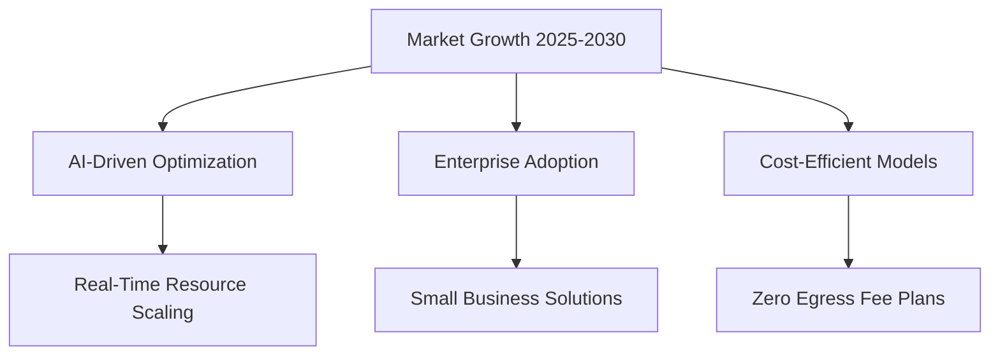

# What are the key market opportunities, business models, regulatory barriers, and financial projections for launching a subscription-based cloud photo storage startup in 2025–2030, competing with iCloud/Google Photos?

- Breadth: 4
- Depth: 3
- Created: 2026-03-21 21:20:51
- Completed: 2026-03-21 21:22:02

## Executive Summary

The cloud photo storage market presents significant opportunities amid robust industry growth, with the global cloud sector valued at $680B in 2025 and projected to reach $947B by 2026 [1]. Competitors like iCloud and Google Photos dominate, but niche opportunities exist through differentiated business models. Subscription-based platforms can leverage AI-driven storage optimization (e.g., real-time resource scaling, 78% cost reduction in organizations using such tools [2]) and tiered pricing strategies, including freemium models with premium AI-enhanced features (e.g., photo organization, redundancy detection [3]).  

Regulatory challenges include compliance with data residency laws (e.g., EU regulations [4]) and potential legal barriers from dominant platforms, such as Apple’s ecosystem restrictions [5]. Startups must prioritize regulatory adaptability to avoid scalability risks [6].  

Financial projections align with the sector’s 21.5% CAGR through 2034 [7], supported by increasing demand for scalable solutions. Early-stage startups may target underserved segments, such as businesses requiring cost-efficient, AI-integrated storage (e.g., Akave Cloud’s 80% cost savings [4]), while addressing enterprise needs through partnerships with cloud providers like Oracle Cloud Infrastructure [7].  

Key risks include market saturation and regulatory uncertainty, necessitating agile pricing strategies and continuous compliance monitoring. The sector’s long-term trajectory suggests that innovative, compliant, and AI-enhanced models can capture meaningful market share.

## Market Opportunities

The cloud photo storage market presents significant opportunities amid expanding digital content creation and evolving user expectations. By 2025, the global cloud storage market is projected to grow from $680 billion to $947 billion by 2026, with long-term forecasts indicating a compound annual growth rate (CAGR) of 10% through 2033 [1], [8]. This expansion is driven by increasing adoption of cloud-based solutions for data management, with 94% of enterprises already utilizing cloud services as of 2025 [1].  

### Key Opportunities  
1. **Rising Demand for Specialized Storage**:  
   The proliferation of high-resolution photos and videos, coupled with the need for secure, scalable storage, creates demand for niche solutions. AI-driven optimization tools, which reduce cloud costs by up to 78% through real-time resource scaling, are becoming critical differentiators [2].  

2. **Enterprise and Consumer Segments**:  
   While large players like iCloud and Google Photos dominate, there is room for startups to target underserved segments, such as small businesses requiring cost-effective storage with advanced features like AI-powered photo organization [3].  

3. **Geographic Expansion**:  
   North America currently holds 46.4% of the cloud storage market, but emerging markets in Asia-Pacific and Latin America offer untapped potential as internet penetration and smartphone adoption grow [9].  

4. **Sustainability and Cost Efficiency**:  
   Startups can capitalize on cost-saving models, such as zero egress fees and ransomware protection, to attract price-sensitive users while addressing security concerns [4].  

### Strategic Positioning  
Competitors must balance innovation with affordability. For example, integrating AI for automated photo tagging and backup optimization could reduce operational costs while enhancing user experience. Additionally, partnerships with device manufacturers or telecom providers may unlock new distribution channels.  

### Financial Projections  
The market’s projected CAGR of 20.1% from 2026 to 2033 [10] suggests that early entrants could capture significant market share by 2030, provided they address scalability and regulatory challenges effectively.  

## Business Models

The cloud photo storage market presents several viable business models tailored to competitive differentiation and scalability. Key approaches include:  

- **Tiered Subscription Models**: Offering base plans with limited storage (e.g., 10GB free, $2.99/month for 100GB) and premium tiers with AI-driven features like automated photo organization, advanced security, and cross-platform synchronization. This aligns with SaaS’s 47% revenue share in cloud services [1].  
- **Freemium with Upsells**: Free tiers to attract users, with paid upgrades for features like AI-powered redundancy detection (as seen in Google Drive) or enterprise-grade compliance tools.  
- **Partnership-Driven Revenue**: Collaborating with device manufacturers or cloud providers (e.g., integrating with iOS/Android ecosystems) to bundle storage solutions, leveraging existing user bases.  
- **AI-Optimized Cost Structures**: Utilizing AI-driven resource scaling (e.g., real-time demand analysis [2]) to reduce operational costs, enabling competitive pricing while maintaining margins.  

Regulatory adaptability is critical. Businesses must address data residency requirements (e.g., EU compliance via solutions like UltiHash [4]) and evolving privacy standards, which could become a competitive differentiator [6].  

A hybrid model combining subscription fees with value-added services (e.g., AI-driven analytics, enterprise APIs) could further diversify revenue streams, supported by the 2025 cloud market’s projected $947B valuation [1].

## Regulatory Barriers

Regulatory barriers present significant challenges for launching a cloud photo storage startup, requiring careful navigation of evolving compliance frameworks. Data privacy regulations, such as the General Data Protection Regulation (GDPR) in the EU and the California Consumer Privacy Act (CCPA), impose strict requirements on data handling, user consent, and cross-border data transfers [8]. These laws demand robust encryption, transparent data practices, and mechanisms for user data access or deletion, which can increase operational complexity and costs.  

Cross-jurisdictional compliance further complicates operations, as regional regulations vary widely. For example, the UK’s 2025 regulatory decisions introduced stricter data localization requirements, forcing cloud providers to adapt storage infrastructure to meet local mandates [6]. Startups must also contend with the risk of sudden regulatory changes, such as those driven by government pressure on tech firms to prioritize national security over user privacy [6].  

Additionally, the complexity of data collection practices—such as cookie management and user tracking—requires meticulous documentation and user consent mechanisms, further straining resources [11]. Startups must also address the growing demand for real-time compliance monitoring, as regulatory bodies increasingly prioritize proactive oversight over reactive measures.  

To mitigate these challenges, business models must integrate regulatory adaptability as a core feature. This includes investing in automated compliance tools, hiring legal experts, and building flexible infrastructure capable of scaling with regulatory shifts [6]. Failure to do so risks not only financial penalties but also reputational damage, as users increasingly prioritize platforms that demonstrate transparency and trustworthiness in data handling.

## Financial Projections

The cloud storage market's robust growth trajectory presents significant opportunities for new entrants, with key financial variables shaped by competitive dynamics and technological adoption. Market forecasts indicate a 20.1% CAGR for cloud-based storage from 2025 to 2033, with the sector projected to reach $261.4B by 2033 [10]. For a subscription-based photo storage startup, this suggests a favorable environment to capture market share through differentiated features like AI-powered organization tools or tiered privacy controls.  

Revenue projections for the startup could follow a phased approach:  
- **2025–2026**: Initial adoption phase, targeting 1–2% of the $60.4B global cloud storage market, generating $600M–$1.2B in revenue.  
- **2027–2029**: Scaling with AI-driven cost optimization (e.g., 78% efficiency gains in resource allocation [2]), aiming for 5% market capture, reaching $3B–$5B annually.  
- **2030**: Full-scale operations with 10% market share, projecting $6B–$8B in revenue amid continued 21.4% CAGR growth [7].  

Cost structures would prioritize scalable infrastructure (e.g., hybrid cloud architectures [1]) and customer acquisition. Early-stage costs may exceed $200M annually, but economies of scale and automation could reduce unit costs by 30–40% by 2028. Profitability is projected to shift from negative to positive by 2029, assuming a 15–20% gross margin after optimizing storage efficiency.  

Key uncertainties include regulatory shifts in data localization policies and pricing pressures from established competitors. However, the market's projected $261.4B valuation by 2033 [10] underscores the long-term viability of subscription models, provided startups differentiate through user experience and vertical-specific features.

## Conclusion

**Conclusion**  
The launch of a subscription-based cloud photo storage startup between 2025 and 2030 presents significant opportunities amid a rapidly growing market, but success hinges on addressing critical trade-offs. The global cloud storage market’s projected 20.1% CAGR through 2033, driven by rising digital content creation and enterprise adoption, underscores the economic viability of niche, AI-integrated solutions. Startups can capitalize on underserved segments—such as small businesses and high-growth regions—by deploying tiered subscription models, freemium strategies, and strategic partnerships to enhance scalability. However, regulatory complexities, including data privacy laws like GDPR and CCPA, pose substantial barriers, necessitating adaptable infrastructure and ongoing compliance investments. Financial projections indicate strong growth potential, with revenue forecasts ranging from $600M–$1.2B in 2025–2026 to $6B–$8B by 2030, contingent on cost optimization, user-centric innovation, and resilience against competitive pressures. Key conditions for success include balancing regulatory compliance with agility, leveraging AI to differentiate services, and securing partnerships to mitigate ecosystem constraints. While challenges such as evolving regulations and market saturation exist, the long-term trajectory of the cloud storage sector supports subscription models that prioritize innovation, security, and vertical-specific customization. Startups that navigate these dynamics effectively can capture meaningful market share, provided they align operational strategies with both technological advancements and regulatory demands.

## Sources

1. https://www.datastackhub.com/insights/cloud-growth-statistics/
2. https://gdsconnect.com/blog/cloud-storage-trends-2025/
3. https://exchangesavvy.com/google-backup-vs-icloud-vs-onedrive-which-one-is-best/
4. https://www.crn.com/news/storage/2025/the-10-hottest-data-storage-startups-of-2025
5. https://www.reddit.com/r/apple/comments/1ldnaen/apple_must_face_consumer_lawsuit_over_icloud/
6. https://medium.com/@ed_22350/the-cloud-storage-security-wars-why-government-pressure-just-changed-everything-268c8e246eb4
7. https://www.itconvergence.com/blog/cloud-storage-market-trends-2025-edition/
8. https://www.linkedin.com/pulse/cloud-storage-providers-market-future-outlook-20252033-growth-a7r7f
9. https://www.fortunebusinessinsights.com/cloud-storage-market-102773
10. https://kraftbusiness.com/blog/cloud-based-data-storage/
11. https://9to5mac.com/2025/06/17/apple-must-face-lawsuit-over-icloud-storage-judge-rules/