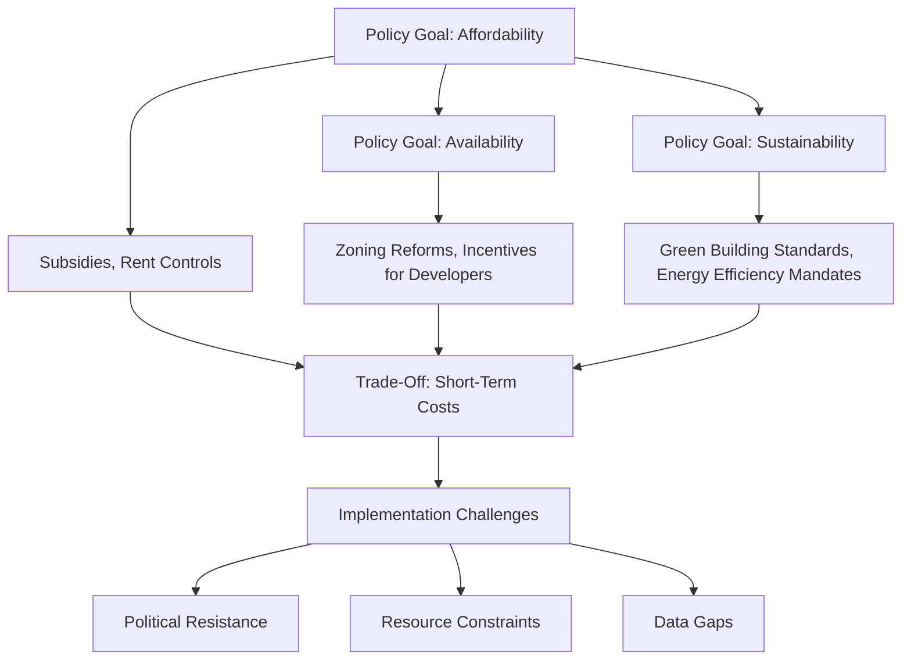

# Europe’s Housing Crisis: Structural Causes, Policy Trade-Offs, and the Most Effective Interventions

- Breadth: 6
- Depth: 3
- Created: 2026-04-05 00:12:23
- Completed: 2026-04-05 00:15:20
- Sources: AcademicOnly

## Understanding the Europe Housing Crisis

Europe’s housing crisis is marked by rising rents, energy costs, and uneven policy effectiveness across regions. As of 2024, the European Housing Crisis Monitor reports that 22% of households face severe housing deprivation, with Southern and Eastern Europe experiencing the highest rates of unaffordable housing [1]. Key drivers include population growth, immigration, and structural differences in housing systems. For instance, immigration has been linked to a 15% increase in housing price pressure in countries like Germany and France over the past decade [2], while the 2008 Global Financial Crisis triggered a 20% average decline in housing prices, with dynamic systems like Ireland and the UK facing sharper adjustments compared to more stable markets such as Germany [3].  

Regional variations highlight systemic disparities. Southern European countries, including Spain and Portugal, struggle with high mortgage arrears and limited social housing, whereas Northern European nations like Sweden and Denmark emphasize rent control and public housing investments [1]. The role of speculative construction and social housing availability further exacerbates these gaps, with countries like Austria and the Netherlands maintaining more balanced housing markets through stringent regulations [3].  

The most affected populations include low-income households, immigrants, and young adults. In 2023, 35% of young people in Europe reported difficulty securing housing, often due to stagnant wages and limited access to affordable mortgages [2]. Additionally, the crisis has intensified spatial inequalities, with urban centers experiencing severe overcrowding while rural areas face depopulation and underinvestment. Policy responses remain fragmented, with some countries prioritizing market-driven solutions and others adopting more interventionist approaches to address systemic imbalances [1].

## Structural Causes of the Crisis

The structural causes of Europe’s housing crisis are deeply intertwined with demographic, urban, regulatory, and economic dynamics. Demographic shifts, particularly population growth driven by immigration and aging populations, have significantly increased demand for housing. Research highlights that population growth exerts a strong positive effect on housing price growth, with immigration exacerbating pressure on property markets [2]. At the same time, aging populations create uneven demand patterns, with rural areas facing depopulation while urban centers experience intensified scarcity [1].

Urbanization trends further amplify these challenges. The concentration of economic opportunities in cities has led to unsustainable demand for housing, outpacing supply mechanisms. This is compounded by land use regulations that restrict development. For instance, stringent zoning laws and bureaucratic hurdles in many European countries limit the construction of new housing, particularly in high-demand areas [3]. Such regulations, while often intended to preserve environmental or aesthetic values, frequently result in artificial scarcity and inflated prices.

Economic factors also play a critical role. GDP growth and wage trends directly influence housing affordability, with studies showing a positive correlation between economic expansion and housing price increases [2]. However, the crisis also reveals systemic vulnerabilities in financial systems. Dynamic housing markets, such as those in the UK and Ireland, experienced greater instability due to reliance on speculative construction and high mortgage debt, whereas more regulated systems like Germany’s showed greater resilience [3]. These disparities underscore the impact of structural differences in housing systems, including the role of social housing and regulatory frameworks.

The interplay of these factors creates a complex web of challenges. While demand-side pressures are dominant, supply-side constraints and financial system vulnerabilities cannot be overlooked. Addressing the crisis requires policies that balance demographic realities, urban planning, regulatory flexibility, and economic stability.

## Policy Trade-Offs and Implementation Challenges

European housing policies reflect a complex interplay of structural factors, with trade-offs between affordability, availability, and sustainability shaping outcomes. For instance, demand-side factors like GDP growth and wage increases drive housing prices, but these are compounded by supply-side constraints and financial dynamics, requiring multifaceted policy approaches [2]. Comparative analyses reveal that countries with more conservative credit policies prior to the 2008 crisis experienced slower housing price increases, highlighting the role of institutional frameworks in mitigating speculative bubbles [4].  

Policy implementation faces challenges rooted in structural differences across housing systems. Nations with limited social housing provisions, for example, struggle to balance affordability with sustainability, as speculative construction and market-driven approaches exacerbate inequality [3]. Meanwhile, Euro Area countries exhibit heterogeneous responses, with group A (countries less affected by the 2008 crisis) showing higher housing price growth, underscoring the need for region-specific strategies [2].  

Implementation hurdles also include the tension between short-term affordability measures and long-term sustainability. Subsidies for low-income housing may improve immediate access but risk creating dependency without addressing supply-side bottlenecks, such as restrictive zoning laws or slow permitting processes [1]. Additionally, second-tier cities in Central and Eastern Europe face unique pressures from global real estate investment, demanding localized governance tools to prevent gentrification and ensure equitable development [5].  

A key trade-off lies in prioritizing housing availability versus environmental sustainability. While expanding housing stock can reduce prices, it may also strain resources or increase carbon footprints unless paired with green building standards. This dilemma is compounded by varying national priorities, as seen in the divergent approaches to energy-efficient renovations across Europe [1].  

## Comparative Analysis of Effective Interventions

The comparative analysis of housing interventions in Europe reveals significant variation in effectiveness, shaped by structural, economic, and institutional factors. Supply-side measures, such as increasing housing stock, are critical but face challenges in countries with rigid zoning laws or limited construction capacity. For example, the book *Housing in Crisis: Policies and Challenges in Europe* highlights that structural factors like tenure structure and housing stock differences explain varying housing cost dynamics across the continent [1]. In contrast, affordability programs often require complementary regulatory frameworks to prevent market distortions. Lausanne’s success in managing housing affordability through comprehensive regulations underscores the importance of aligning technical interventions with institutional capacity [5].  

Regulatory reforms, particularly in mortgage markets, show mixed outcomes. Countries with conservative credit policies, like those in Central and Eastern Europe, experienced slower housing price increases during the 2008 crisis, while dynamic systems like Ireland’s faced greater volatility [3]. Affordability initiatives also depend on context: demand-side factors such as GDP growth and wage levels strongly influence housing prices, yet supply-side constraints and financial regulations remain pivotal [2].  

A key takeaway is the need for tailored approaches. The book emphasizes that no single intervention addresses all structural causes, and country-specific governance models—such as Germany’s emphasis on social housing versus the UK’s market-driven strategies—are crucial for policy efficacy [1]. This complexity necessitates integrated strategies that balance supply expansion, affordability safeguards, and adaptive regulatory frameworks.

## Recommendations for Effective Housing Policies

The following evidence-based recommendations address Europe’s housing crisis by balancing structural reforms, institutional capacity, and localized interventions. These strategies prioritize affordability, equity, and long-term stability while acknowledging regional complexities:

1. **Strengthen Institutional Frameworks for Affordable Housing**  
   Policymakers should establish robust, multi-level governance structures that integrate local, regional, and national planning. These frameworks must prioritize social housing goals, counteracting neoliberal market dynamics through binding regulations and public investment. Lausanne’s success in maintaining affordability through municipal planning tools demonstrates the viability of such approaches [5], while second-tier cities require similar multi-scalar coordination to address uneven development [5].

2. **Prioritize Place-Based, Context-Dependent Strategies**  
   Tailored interventions are critical for addressing localized challenges. The EU’s URBACT program and Cohesion Policy offer models for fostering place-based innovation, emphasizing community engagement and adaptive governance [6]. In the UK, realist evaluations highlight the importance of understanding how specific mechanisms—like landlord-tenant relationships—interact with broader systemic factors [7].

3. **Balance Supply-Side and Demand-Side Policies**  
   While supply-side measures (e.g., streamlining construction permits, incentivizing affordable housing) are essential, they must be paired with macroprudential policies to prevent financial system vulnerabilities. Studies show that financial development and credit availability directly influence housing demand, necessitating safeguards against speculative bubbles [2], while also ensuring that supply-side constraints are not overlooked [2].

4. **Protect and Expand Affordable Housing Programs**  
   Reforms like England’s "Right to Buy" policy risk undermining affordability by reducing housing stock. Policymakers must mitigate such threats through legal safeguards, rent control mechanisms, and subsidies for low-income households. Research underscores the need for flexible yet enforceable regulations to prevent market-driven displacement [8].

5. **Invest in Data-Driven, Adaptive Governance**  
   Real-time data systems and iterative policy evaluation are necessary to respond to shifting market conditions. The UK’s South West region’s use of Initial Programme Theories (IPTs) to refine PRS housing interventions illustrates the value of context-specific, evidence-based adjustments [7]. Such approaches should be scaled to other regions to address the "wicked problems" of housing insecurity [1].

These recommendations emphasize the interplay between institutional strength, localized action, and systemic safeguards, aligning with the comparative insights from European housing policies [1].

## Conclusion

**Conclusion**  
Europe’s housing crisis stems from a complex interplay of structural, economic, and institutional factors, necessitating nuanced policy responses. Structural causes—including population growth, urbanization, and fragmented housing systems—create uneven demand and supply dynamics, exacerbated by financial vulnerabilities and restrictive land-use policies. While interventions such as expanding housing supply, enhancing affordability programs, and strengthening regulatory frameworks show promise, their effectiveness hinges on addressing trade-offs between short-term affordability, long-term sustainability, and regional disparities. Policy success depends on context-sensitive strategies that balance supply-side measures with macroprudential safeguards, ensuring economic viability without exacerbating market instability. Key conditions for effective solutions include robust multi-level governance, adaptive regulatory mechanisms, and targeted investments in social housing, alongside community-driven approaches to mitigate spatial and demographic inequalities. Ultimately, overcoming the crisis requires integrating structural reforms with flexible, locally tailored policies that prioritize affordability, resilience, and equitable access to housing across Europe’s diverse socio-economic landscapes.

## Sources

1. https://link.springer.com/book/10.1007/978-3-031-87267-9
2. https://link.springer.com/article/10.1007/s10663-024-09611-5
3. https://link.springer.com/article/10.1007/s10901-011-9230-0
4. https://link.springer.com/article/10.1007/s10901-021-09848-7
5. https://link.springer.com/content/pdf/10.1007/s10901-025-10204-2.pdf
6. https://link.springer.com/content/pdf/10.1186/s42854-021-00019-z.pdf
7. https://link.springer.com/content/pdf/10.1186/s12889-024-19163-9.pdf
8. https://link.springer.com/content/pdf/10.1007/s10901-018-9598-1.pdf