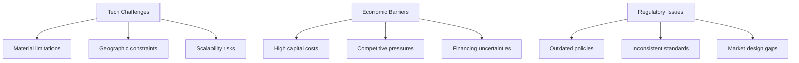

# What are the most promising approaches to long-duration energy storage, and what limits their large-scale deployment?

- Breadth: 5
- Depth: 3
- Created: 2026-03-19 19:36:19
- Completed: 2026-03-19 19:37:37

## Introduction

This report examines the evolving landscape of long-duration energy storage (LDES), focusing on technologies capable of delivering power for six hours or more to address the intermittency of renewable energy sources. As global renewable energy integration accelerates, LDES has emerged as a critical enabler of grid reliability, with deployments reaching 15 GWh globally in 2025—a 49% year-on-year increase [1]. The research explores the most promising approaches, including pumped hydro storage (PHS), compressed air energy storage (CAES), thermal systems, flow batteries, and hydrogen-based solutions, while analyzing barriers to their large-scale adoption.  

Key challenges include technological limitations such as energy density, cycle life, and round-trip efficiency [2], as well as economic and policy-related constraints. For instance, while PHS remains the most mature technology, its deployment is restricted by geographical suitability and high capital costs [3]. Meanwhile, emerging solutions like flow batteries and thermal storage face cost and scalability hurdles [2]. The analysis also highlights systemic challenges, such as outdated market designs and regulatory frameworks that fail to value long-duration storage capabilities [2].  

By synthesizing technical, economic, and policy insights, this report aims to clarify the pathways for advancing LDES while addressing the multifaceted constraints that currently limit its deployment.

## Current Energy Storage Landscape

Pumped Hydro Storage (PHS) remains the most mature and widely deployed grid-scale energy storage technology, accounting for the majority of global grid-scale capacity. Its ability to store and dispatch large volumes of energy over extended periods makes it a cornerstone of modern energy systems [4]. However, its deployment is constrained by geographical requirements and high upfront costs, limiting its scalability in regions without suitable topography.  

Long-duration energy storage (LDES) technologies, defined as systems capable of discharging for six hours or more, are critical for balancing renewable energy supply and demand. These include established methods like compressed air energy storage (CAES) and emerging solutions such as metal-air batteries, advanced flow batteries, and hydrogen-based storage [5]. Thermal energy storage and hydrogen storage are also gaining attention for their scalability and compatibility with renewable integration, though they face challenges in efficiency and cost [5].  

Current battery technologies, while effective for short-duration applications, struggle with the technical and economic feasibility of long-duration services. This has spurred research into advanced chemistries and alternative approaches, such as gravity-based systems and thermal storage, to address gaps in energy density and cycle life [2]. Despite these innovations, systemic barriers—including outdated policy frameworks, market structures, and regulatory incentives—hinder the large-scale adoption of LDES solutions [6].  

The role of energy storage in modern grids extends beyond technical performance, encompassing socio-economic and environmental dimensions. For instance, end-of-life management and recycling infrastructure are critical for sustainable deployment, while equitable cost distribution remains a challenge [6]. As renewable penetration increases, the interplay between storage technologies, grid planning, and market design will determine the feasibility of transitioning to low-carbon energy systems.

## Promising Approaches for Long-Duration Storage

Long-duration energy storage (LDES) is critical for balancing renewable energy systems, with emerging technologies focusing on solutions capable of discharging for six hours or more. Flow batteries, compressed air energy storage (CAES), hydrogen-based systems, and thermal storage are among the most promising approaches, each addressing unique challenges in scalability, cost, and grid integration. Flow batteries, for instance, offer modular designs and long cycle life, but face hurdles in material sustainability and cost reduction [2]. Similarly, CAES and pumped hydro storage provide large-scale capacity but require specific geographic conditions, limiting their deployment [3].  

Hydrogen-based storage and advanced flow batteries are gaining attention for their potential to decouple energy capacity from power rating, enabling durations of 10–100 hours [3]. However, technical barriers such as reaction predictability and performance validation slow innovation, while high capital costs and supply chain bottlenecks further impede scalability [7], [6].  

The U.S. Department of Energy’s ARPA-E program highlights the importance of disruptive innovations, such as metal-air batteries and thermal storage, to achieve grid resilience with renewable integration [3]. Despite progress, global LDES installations reached 15 GWh in 2025, yet financing challenges and competition from lithium-ion batteries persist [8].  

For 100% renewable energy systems, energy-storage durations must extend to hundreds of hours, necessitating rethinking grid planning and policy frameworks [5]. While technologies like hydrogen and thermal storage show promise, their large-scale deployment hinges on breakthroughs in materials science, system architecture, and governance models [6].

## Barriers to Large-Scale Deployment

Technical challenges for long-duration energy storage (LDES) include material performance limitations, such as energy density, cycle life, and round-trip efficiency, which hinder scalability and cost-effectiveness [2]. While established technologies like pumped hydro storage (PHS) and compressed air energy storage (CAES) offer high capacity and long discharge times, their deployment is constrained by geographic suitability and high upfront capital costs [3]. Emerging solutions like flow batteries and metal-air systems face technical risks related to durability and efficiency, with limited commercial validation at scale [4].  

Economic barriers center on high capital expenditures and uncertain return on investment. Despite 49% year-on-year growth in LDES deployments, financing remains constrained by competition with lithium-ion batteries and declining investor confidence [8]. Technologies like thermal storage and advanced flow batteries show cost-effectiveness potential but require further R&D to overcome scalability challenges [9]. The need for decoupling energy capacity from power rating to enable flexible, scalable solutions adds complexity to economic modeling [5].  

Regulatory hurdles include outdated market structures and policy frameworks ill-suited for long-duration systems. Current energy policies often fail to account for the extended timeframes required for LDES to deliver value, creating misaligned incentives [6]. Grid planning and market designs must evolve to properly value storage over multi-hour or multi-day cycles, which remains a critical gap [2]. Additionally, inconsistent regulatory standards across regions complicate cross-border technology deployment [3].  

## Case Studies

The deployment of long-duration energy storage (LDES) has seen significant real-world implementations, with varying degrees of success and challenges. China’s 49% year-on-year increase in LDES installations to 15 GWh in 2025 highlights the potential of government-supported technologies, particularly those capable of discharging at maximum power for over four hours [1]. This growth underscores the role of policy frameworks in scaling LDES, though financing challenges and competition from lithium-ion batteries remain barriers [8].  

Pumped hydro storage (PHS), the most mature LDES technology, accounts for the largest share of global grid-scale storage capacity. Its reliability and scalability make it a cornerstone of energy systems, though new projects face environmental and geographical constraints [4]. Compressed air energy storage (CAES) and thermal storage are also gaining traction as cost-effective alternatives, with potential for widespread adoption within 2–3 years [9].  

The U.S. Department of Energy’s (DOE) ARPA-E program exemplifies innovation in LDES, funding projects like the DAYS initiative to develop systems capable of 10–100 hours of power output. These efforts aim to enhance grid resilience and renewable integration, reflecting a shift toward long-term storage solutions [3]. However, technical limitations of current battery chemistries—such as energy density and cycle life—hinder their viability for extended durations, necessitating advancements in materials science [2].  

Despite progress, LDES deployment faces systemic hurdles. Wood Mackenzie’s net-zero scenarios emphasize the need for energy storage durations to expand from 2.5 to 20 hours, yet current systems struggle to meet this demand [8]. Additionally, the lack of clear policy signals and regulatory frameworks delays investment, as market designs fail to value storage’s multifaceted grid benefits [2]. These challenges highlight the interplay between technological innovation, economic viability, and policy support in achieving large-scale LDES adoption.

## Strategies for Overcoming Limitations

Strategies to address barriers in long-duration energy storage (LDES) deployment involve technological innovation, policy reform, and financing mechanisms. Key approaches include:  

- **Technological Advancements**: Prioritizing cost-effective solutions like compressed air energy storage (CAES) and thermal storage, which offer scalability and proven performance for multi-hour discharge [9]. Flow batteries and metal-air technologies are also gaining traction for their potential to decouple energy capacity from power rating, enabling longer-duration storage [4].  

- **Policy and Market Reforms**: Restructuring energy markets to value long-duration storage, such as by incentivizing grid planning that accounts for extended timeframes and integrating LDES into renewable energy targets. Regulatory frameworks must address uncertainty and align with net-zero goals, as current policies often fail to optimize for modern storage needs [2].  

- **Financing and Investment**: Overcoming cost barriers through public-private partnerships, targeted subsidies, and risk-mitigation strategies. While LDES installations grew 49% in 2025, declining investment and competition from lithium-ion batteries remain challenges [8]. Scaling requires aligning financial models with the extended payback periods of LDES technologies.  

- **Grid Integration and System Design**: Enhancing grid flexibility to accommodate variable renewable sources, with LDES critical for stabilizing systems with high wind and solar penetration. This includes updating infrastructure to handle multi-day energy cycles and ensuring reliability during prolonged low-generation periods [5].  

- **Socio-Economic Equity Considerations**: Ensuring equitable distribution of LDES benefits, such as reducing regional disparities in energy access and mitigating environmental impacts on vulnerable communities [6].  

These strategies must address technical limitations, such as energy density and cycle life, while fostering collaboration across industries and governments to accelerate deployment [3].

## Conclusion

The most promising approaches to long-duration energy storage (LDES) include flow batteries, hydrogen-based systems, thermal storage, and advanced pumped hydro, each offering unique advantages for balancing renewable energy intermittency. However, their large-scale deployment faces significant constraints. Technically, these systems encounter limitations in material performance, geographic feasibility, and scalability, particularly for emerging technologies like hydrogen and flow batteries, which require breakthroughs in cost-effective, durable designs. Economically, high capital expenditures, competition from lithium-ion batteries, and extended payback periods hinder financial viability, despite growing demand for storage durations exceeding 10 hours. Regulatory barriers, such as outdated policy frameworks and inconsistent market designs, further impede progress by failing to recognize the distinct value of long-duration systems. While PHS remains the dominant solution due to its reliability, its deployment is restricted by geographical constraints and high upfront costs. Case studies, such as China’s 49% year-on-year growth in LDES capacity, highlight the potential for expansion but also underscore challenges like financing gaps and systemic underinvestment. Overcoming these barriers necessitates coordinated strategies: technological innovation to enhance efficiency and reduce costs, policy reforms to align regulatory frameworks with net-zero goals, and financing mechanisms like public-private partnerships to mitigate economic risks. Key conditions for success include grid modernization, market structures that value long-duration storage, and sustained R&D investment. Ultimately, the transition to 100% renewable systems hinges on balancing these trade-offs, ensuring that economic, technical, and policy challenges are addressed in tandem to enable scalable, reliable, and equitable energy storage solutions.

## Sources

1. https://www.utilitydive.com/news/long-duration-energy-storage-deployments-rose-49-in-2025-woodmac/814336/
2. https://energy.sustainability-directory.com/question/what-are-the-barriers-to-energy-storage/
3. https://www.energy.gov/sites/prod/files/2019/07/f64/2018-OTT-Energy-Storage-Spotlight.pdf
4. http://large.stanford.edu/courses/2024/ph240/cranmer2/
5. https://www.the-innovation.org/article/doi/10.59717/j.xinn-energy.2025.100077
6. https://energy.sustainability-directory.com/question/what-are-the-storage-scalability-challenges/
7. https://www.neto-innovation.com/post/breaking-barriers-challenges-to-implementing-innovative-energy-storage-solutions
8. https://www.woodmac.com/press-releases/ldes-2025-outlook/
9. https://www.mitsui.com/mgssi/en/report/detail/__icsFiles/afieldfile/2025/03/27/2501btf_inada_ishiguro_e.pdf