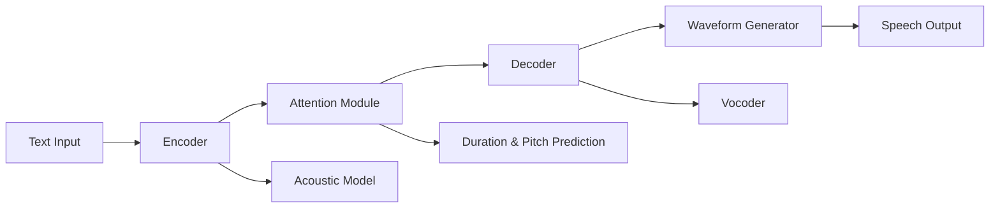

# Please provide an overview of neural networks for text-to-speech: How to generate speech from text using AI in 2026.

- Breadth: 3
- Depth: 2
- Created: 2026-04-03 20:39:36
- Completed: 2026-04-03 20:41:02
- Sources: Balanced

## Core Mechanisms of Text-to-Speech Neural Networks

Neural networks for text-to-speech (TTS) in 2026 rely on deep learning architectures that transform text into natural-sounding speech through layered processing stages. These systems replace older concatenative methods, which relied on pre-recorded speech fragments, by generating waveforms from scratch using end-to-end neural models [1]. The core mechanism involves multiple specialized components:  

1. **Text Preprocessing and Linguistic Analysis**:  
   Text is first normalized and segmented into phonemes or subwords, with linguistic features like stress and intonation extracted. This stage often uses transformer-based models to capture context-aware representations [1].  

2. **Acoustic Modeling**:  
   A neural network predicts acoustic features (e.g., mel-spectrograms) from text, mapping linguistic units to audio characteristics. Advanced models like Qwen3-TTS employ dual-track architectures with discrete multi-codebook language models to achieve high-fidelity speech reconstruction [2].  

3. **Vocoding**:  
   The predicted acoustic features are converted into raw audio waveforms. Modern vocoders, such as those in Fish Speech V1.5, use autoregressive transformers to generate speech with natural prosody and minimal artifacts [3].  

4. **End-to-End Integration**:  
   Recent systems combine all stages into a single neural network, reducing latency and improving naturalness. For example, NeuTTS Air (0.5B parameters) enables real-time inference on consumer hardware by optimizing parameter efficiency [4].  

Key innovations include zero-shot capabilities (e.g., IndexTTS-2’s disentangled emotional and speaker features) [3] and speaker adaptation via transfer learning, which minimizes data requirements for custom voice creation [5]. These advancements enable applications from accessibility tools to AI-driven voice agents, with models like Fish Speech V1.5 achieving 3.5% word error rates in English [3].  

A typical workflow involves:  
- Text normalization and tokenization  
- Linguistic feature extraction  
- Acoustic feature prediction  
- Waveform generation via vocoding  

This multi-stage approach, powered by large-scale training on diverse speech datasets, ensures flexibility across languages and speaking styles while maintaining real-time performance [1].

## Key Components and Architectures

Neural text-to-speech (TTS) systems in 2026 rely on advanced neural network architectures to generate natural, human-like speech from text. These systems integrate multiple components, including encoder-decoder frameworks, attention mechanisms, and waveform generation techniques, to achieve high fidelity and expressiveness.  

**Encoder-Decoder Frameworks**: Modern TTS systems often employ encoder-decoder architectures, where the encoder processes text input into linguistic features, and the decoder generates corresponding speech signals. For example, end-to-end models like Qwen3-TTS use a dual-track language model architecture, combining discrete multi-codebook language models for full-information speech modeling [2]. Traditional pipelines, however, still separate stages such as text preprocessing, acoustic modeling, and vocoding, with neural networks handling tasks like pitch prediction, duration estimation, and waveform synthesis [1].  

**Attention Mechanisms**: Attention mechanisms are critical for aligning text elements with corresponding speech segments, enabling models to capture long-range dependencies and contextual nuances. Models like Fish Speech V1.5 leverage dual autoregressive transformers (DualAR) to enhance attention-based alignment, improving performance in multilingual TTS tasks [3]. These mechanisms allow systems to dynamically focus on relevant parts of the input, resulting in more coherent prosody and intonation.  

**Waveform Generation Techniques**: Recent advancements prioritize waveform-level generation over traditional parametric approaches. Neural TTS systems now directly synthesize raw audio waveforms using deep learning models, achieving natural-sounding results with realistic breathing patterns and intonation [6]. Techniques such as autoregressive transformers and hybrid architectures (e.g., NeuTTS Air) enable real-time generation while maintaining high-quality output, even on consumer hardware [4].  

A simplified architectural overview is illustrated below:  

This structure highlights the integration of encoding, attention, decoding, and waveform generation, reflecting the complexity of modern TTS systems.

## Training Data and Model Optimization

Training data and model optimization for text-to-speech (TTS) in 2026 emphasize large-scale, high-quality datasets and advanced architectural designs. Modern TTS systems rely on extensive multilingual corpora, with models like Qwen3-TTS leveraging dual-track language architectures and discrete multi-codebook language models to achieve high-fidelity speech reconstruction [2]. Speaker-adapted models now reduce data requirements through transfer learning, enabling lifelike voices with shorter recording sessions [5].  

Preprocessing methods focus on normalization, noise reduction, and context-aware tokenization to handle diverse input formats. For instance, MiniMax TTS supports 30+ languages and processes up to 200,000 characters per request, reflecting advancements in handling long-form text [1]. Emotionally intelligent systems, such as Hume AI's Octave TTS, integrate large language models (LLMs) to dynamically adjust tone and rhythm based on contextual analysis, eliminating manual SSML tagging [1].  

Optimization strategies prioritize efficiency and scalability. Models like MiniMax Speech's Speech-02-Turbo achieve sub-2-second response times with thousands of characters per second throughput, addressing high-throughput demands [7]. Architectural innovations, such as dual autoregressive transformers in Fish Speech V1.5, balance quality (3.5% word error rate) with computational efficiency [3]. However, challenges persist: ChatTTS demonstrates stability issues despite 100k hours of training data, highlighting the trade-off between data volume and model reliability [4].  

By 2026, TTS systems combine these elements to produce human-like speech, with metrics like MOS scores improving from 5.4 to 5.53 in models like CosyVoice2-0.5B [3]. Key trends include zero-shot capabilities for new languages, fine-grained emotional control, and deployment flexibility across cloud and edge systems [5].

## Performance Evaluation and Metrics

Performance evaluation of text-to-speech (TTS) systems in 2026 relies on a combination of objective metrics, subjective assessments, and benchmarking against standardized datasets. Key metrics include word error rate (WER), character error rate (CER), and perceptual quality scores such as STOI (Short-Time Objective Intelligibility), UTMOS (Unified Text-to-Speech Mean Opinion Score), and PESQ (Perceptual Speech Quality Measurement). For example, Qwen3-TTS achieves STOI 0.96, UTMOS 4.16, and PESQ Wideband 3.21, indicating near-lossless speech quality [2]. Fish Speech V1.5 demonstrates a 3.5% WER in English and 1.2% CER for Chinese characters, outperforming traditional systems [3], [3].  

Benchmarks like TTS Arena evaluate models through automated metrics and human listening tests. Fish Speech V1.5 scores an ELO rating of 1339, reflecting strong performance against baseline systems [3]. Hume AI’s Octave TTS emphasizes emotional intelligence, achieving 200ms latency while adjusting tone and rhythm based on contextual analysis [1].  

Evaluation methodologies often combine objective scores with subjective assessments. For instance, Speaker Similarity metrics (e.g., 0.95 for Qwen3-TTS) quantify how closely generated speech matches target voices [2]. Multilingual support and low-latency deployment are also critical, as seen in MiniMax TTS’s 30+ language coverage and FishAudio-S1-mini’s 10-second voice cloning capability [1], [4].  

While most systems prioritize speech quality and accuracy, some focus on specialized features like emotional expression (e.g., Hume AI’s context-aware tone adjustment [1]) or zero-shot duration control [3]. These variations highlight the need for tailored evaluation frameworks to address specific use cases.

## Adoption Drivers and Challenges

Adoption of AI-based text-to-speech (TTS) systems in 2026 is driven by advancements in emotional intelligence, real-time processing, and multilingual capabilities. Emotional intelligence in TTS, enabled by large language models (LLMs), allows systems like Hume AI's Octave TTS to adjust tone and rhythm based on contextual analysis, supporting 11 languages with 200ms latency [1]. Real-time conversational AI benefits from WebSocket streaming architectures, as seen in Inworld AI's TTS-1 Max, which eliminates buffering delays for instant audio generation [7]. Multilingual support has expanded significantly, with models like IndexTTS-2 offering disentangled emotional expression and speaker identity control, while MiniMax TTS covers 30+ languages including strong Asian language support [1]. Customization options now include zero-shot voice cloning with sub-second audio samples, reducing reliance on extensive training data through transfer learning [6].

Technical challenges persist in balancing expressiveness with stability, as seen in ChatTTS's limited emotional control and occasional instability despite its conversational optimization [4]. Economic barriers include the high computational costs of deploying models like Inworld AI's TTS-1 Max, which requires specialized infrastructure for real-time performance [7]. Regulatory concerns around voice cloning and data privacy remain unresolved, particularly with systems capable of replicating voices from minimal audio samples [6]. These challenges highlight the tension between innovation and ethical constraints in AI TTS development.

## Applications and Use Cases

Text-to-speech (TTS) technology in 2026 has expanded beyond basic voice synthesis to become a foundational tool across industries, driven by advancements in neural network architectures. Key applications include:

- **Accessibility and Assistive Technologies**: Neural TTS systems now generate natural-sounding, context-aware speech for individuals with visual impairments or speech disabilities. These systems leverage large-scale datasets and emotional intelligence capabilities to adapt tone and rhythm dynamically, enhancing user engagement [1].  

- **Real-Time Customer Service and Voice Agents**: Platforms like Speechmatics and Inworld AI offer low-latency TTS solutions (sub-150ms) for voice agents, enabling seamless, human-like conversations. These systems integrate with speech-to-text (STT) pipelines to create unified voice platforms, critical for call centers and virtual assistants [1].  

- **Multilingual and Custom Voice Deployment**: TTS models now support 11+ languages with customizable emotional expression, speaker identities, and vocal styles. For example, Inworld AI's TTS-1 Max allows developers to fine-tune speech parameters like speed and temperature, enabling personalized voice experiences [7].  

- **Content Creation and Media**: Tools like IndexTTS-2 provide zero-shot speech generation with precise control over speech duration, revolutionizing video dubbing and audiobook production. This is paired with disentangled models that separate emotional expression from speaker identity [3].  

- **Healthcare and Education**: Neural TTS supports real-time transcription and synthesis for telemedicine, patient communication, and e-learning. Systems like AssemblyAI's Universal-Streaming model offer near-instantaneous speech processing, critical for interactive educational tools [8].  

These applications highlight TTS's role as a versatile AI primitive, with neural networks overcoming previous limitations in naturalness, latency, and customization. However, challenges remain in ensuring ethical use, avoiding bias in generated speech, and maintaining privacy in real-time systems.

## Conclusion

**Conclusion**  
By 2026, neural networks for text-to-speech (TTS) have advanced significantly, leveraging end-to-end architectures, attention mechanisms, and hybrid waveform generation techniques to produce natural, context-aware speech. Key innovations include zero-shot language capabilities, speaker adaptation via transfer learning, and high-fidelity vocoders, enabling real-time performance on consumer hardware. These systems integrate encoder-decoder frameworks with advanced preprocessing and optimization strategies, reducing data requirements while maintaining high fidelity, as evidenced by metrics like STOI (0.96) and WER (1.2% for Chinese).  

Economic viability is driven by scalable deployment across cloud and edge systems, with applications spanning accessibility, customer service, and healthcare. However, trade-offs persist: balancing computational efficiency with expressive realism, managing the costs of real-time processing, and addressing ethical concerns such as voice cloning and bias. Regulatory and privacy challenges remain unresolved, necessitating careful implementation.  

Critical conditions for success include access to large-scale, high-quality datasets, efficient model architectures prioritizing latency and scalability, and tailored evaluation frameworks for specialized use cases. While advancements in emotional intelligence and multilingual support have expanded TTS capabilities, ongoing research focuses on improving stability, reducing computational overhead, and ensuring equitable speech generation. Overall, 2026 TTS systems represent a mature, versatile technology, yet their deployment hinges on navigating technical, economic, and ethical trade-offs to deliver natural, adaptive, and socially responsible speech synthesis.

## Sources

1. https://www.speechmatics.com/company/articles-and-news/best-tts-apis-in-2025-top-12-text-to-speech-services-for-developers
2. https://dev.to/gary_yan_86eb77d35e0070f5/qwen3-tts-the-open-source-text-to-speech-revolution-in-2026-3466
3. https://www.siliconflow.com/articles/en/best-open-source-text-to-speech-models
4. https://www.bentoml.com/blog/exploring-the-world-of-open-source-text-to-speech-models
5. https://www.readspeaker.com/blog/neural-text-to-speech/
6. https://fatcowdigital.com/blog/ai-topics/ai-text-to-speech-guide-2026/
7. https://inworld.ai/resources/best-text-to-speech-apis
8. https://www.assemblyai.com/blog/the-voice-ai-stack-for-building-agents