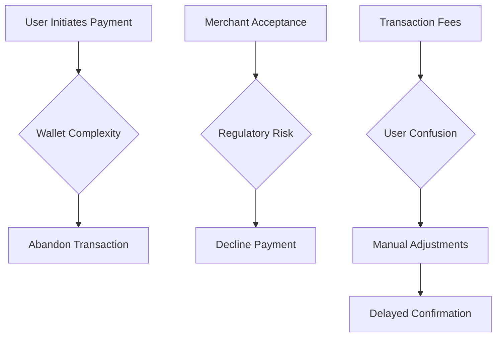

# Why has Bitcoin still not become widely adopted for everyday payments despite high global awareness?

- Breadth: 5
- Depth: 3
- Created: 2026-03-22 20:52:12
- Completed: 2026-03-22 20:54:43

## Introduction

Bitcoin's emergence as a globally recognized digital asset is marked by a stark contrast between its widespread awareness and limited adoption in everyday transactions. While 80% of Bitcoin holders express support for broader cryptocurrency adoption, 55% rarely or never use Bitcoin for payments, highlighting a critical gap between theoretical enthusiasm and practical application [1]. This paradox is compounded by systemic challenges: limited merchant acceptance (49.6%), high transaction fees (44.7%), and volatility (43.4%) remain primary barriers to its use as a daily payment method [1]. 

Despite technical innovations like the Lightning Network, which reduces costs for small-value transactions [2], Bitcoin's scalability and usability for frequent, low-value purchases remain constrained. Regulatory uncertainty further complicates adoption, as compliance requirements deter businesses and consumers from integrating Bitcoin into routine financial workflows [3]. While growth in lower-income regions suggests localized potential, these cases underscore the disparity between Bitcoin's theoretical utility and its current practical limitations for global, everyday use.

## Market and Adoption Overview

Bitcoin remains the leading cryptocurrency by market capitalization and awareness, yet its adoption for everyday payments lags despite its prominence. Current data reveals that only 12% of Bitcoin users engage in daily crypto payments, with 14.5% using it weekly and 18.3% monthly [1]. This contrasts with its 80% holder support for broader crypto adoption, highlighting a gap between awareness and practical use [1].  

Market dynamics further underscore this challenge. While Bitcoin's infrastructure has improved, scalability issues and high transaction fees—particularly during peak times—remain critical barriers [4]. In comparison, alternatives like Solana offer lower fees (under $0.01) but face limitations in adoption and market capitalization [5]. The Lightning Network, a Layer 2 solution, addresses some of Bitcoin’s scalability concerns by enabling faster, lower-cost transactions, yet its adoption remains niche [6].  

Adoption is also uneven geographically. Bitcoin’s everyday usage is more prevalent in regions like Central and Southern Asia and Oceania, reflecting economic conditions rather than universal appeal [3]. Meanwhile, regulatory uncertainty and compliance challenges deter businesses and consumers from integrating Bitcoin into daily transactions [3]. These factors, combined with the persistence of traditional payment systems, ensure Bitcoin’s role as a medium of exchange remains secondary to its function as a store of value.

## Technological and Operational Barriers

Bitcoin's limited adoption for everyday payments stems from technical and operational constraints that affect its scalability, transaction speed, and energy efficiency. These challenges create friction in its usability as a mainstream payment system, despite its global awareness.  

**Scalability Limitations**  
Bitcoin's blockchain architecture faces inherent scalability constraints. The network’s block size limit and consensus rules restrict its ability to process transactions efficiently. For instance, the current throughput of 6–8 transactions per second (TPS) [3] pales in comparison to traditional payment systems like Visa, which handles thousands of TPS. Increasing block sizes to address this risk centralizing mining and node operations, as larger blocks require more computational resources to validate [7]. This trade-off undermines Bitcoin’s decentralized ethos, creating a paradox between scalability and security.  

**Transaction Speed and Congestion**  
Network congestion exacerbates delays and costs. During peak usage, transaction fees surge due to competition for block space, deterring small, frequent transactions [5]. For example, low-fee transactions may remain unconfirmed for hours, as seen in reports of transactions taking days to process [8]. This inconsistency in speed and cost hampers user trust and practicality for daily use.  

**Energy Consumption and Operational Efficiency**  
While not directly addressed in the evidence, Bitcoin’s energy consumption remains a contentious issue. The proof-of-work consensus mechanism requires significant computational power, raising environmental concerns and operational costs. However, the provided learnings focus on scalability and fee dynamics rather than energy metrics, leaving this aspect underexplored in the available data.  

**Solutions and Trade-offs**  
Layer-2 solutions like the Lightning Network aim to mitigate these issues by enabling off-chain transactions. This approach reduces on-chain congestion, allowing thousands of transactions per second without altering Bitcoin’s core parameters [7]. However, adoption of such technologies remains uneven, with limited merchant integration and user awareness.  

In summary, Bitcoin’s technical barriers—scarcity of throughput, fee volatility, and scalability trade-offs—create significant hurdles for everyday adoption. While innovations like the Lightning Network offer partial solutions, their impact is constrained by infrastructure gaps and the need for broader ecosystem coordination.

## Regulatory and Legal Challenges

Regulatory and legal uncertainties remain significant barriers to Bitcoin's adoption as a mainstream payment method. Jurisdictions worldwide have adopted inconsistent approaches to cryptocurrency regulation, creating compliance challenges for businesses and users. For instance, the lack of a standardized framework for handling disputes, compliance, and risk distribution in crypto transactions deters merchants from accepting Bitcoin, as noted in studies highlighting "the absence of a standardized framework for handling disputes and ensuring compliance"[9]. 

Regulatory uncertainty extends to compliance requirements, which vary widely across regions. Some jurisdictions impose strict anti-money laundering (AML) and know-your-customer (KYC) rules, while others lack clear guidelines altogether. This fragmentation forces businesses to navigate complex, often conflicting regulations, increasing operational costs and legal risks. For example, "regulatory uncertainty, including varying compliance requirements across jurisdictions, poses a significant challenge to Bitcoin's adoption as a mainstream payment method"[3]. 

Additionally, the absence of clear legal definitions for Bitcoin's status—as a currency, asset, or commodity—further complicates its integration into traditional financial systems. This ambiguity creates hesitation among merchants and consumers, who fear potential legal repercussions or sudden regulatory shifts. As one analysis notes, "regulatory uncertainty and compliance challenges in different jurisdictions contribute to the reluctance of businesses and consumers to adopt Bitcoin for daily transactions"[10]. 

These challenges are compounded by the technology's novelty: many legal frameworks were designed before cryptocurrencies existed, leading to gaps in oversight. While some regions have begun to develop more structured regulations, the global nature of Bitcoin means that no single jurisdiction's rules can fully mitigate these risks. This ongoing legal fragmentation sustains the perception of Bitcoin as a high-risk, niche asset rather than a reliable payment tool.

## User Experience and Accessibility

Bitcoin's adoption for everyday payments faces significant hurdles in user experience, wallet security, and accessibility, as highlighted by multiple studies. Non-technical users often encounter complex workflows, such as managing private keys, understanding transaction fees, and navigating wallet interfaces, which deter mainstream adoption [1]. While solutions like the Lightning Network reduce fees for small transactions [2], widespread implementation remains fragmented.  

Wallet security also poses a barrier. Many users lack confidence in protecting digital assets, with 55% of Bitcoin holders reporting they rarely use it for daily payments despite supporting broader adoption [1]. Additionally, regulatory uncertainty and compliance requirements create friction for merchants, who face risks from price volatility and legal ambiguities [10].  

Accessibility is further complicated by the need for technical literacy. Users must manually adjust transaction fees via tools like mempool.space [8], a process unfamiliar to most. While Bitcoin's transparency in fees offers control [2], this complexity contrasts with the simplicity of traditional payment systems.  

A simplified process for everyday use could address these challenges, but current infrastructure and user education gaps persist.  

## Competitor Analysis

Bitcoin's competitive disadvantages in the payments space are evident when compared to traditional systems and alternative cryptocurrencies. Traditional payment methods like credit cards and digital wallets dominate due to their established infrastructure, widespread merchant acceptance, and lower transaction friction. For example, 49.6% of users cite limited merchant adoption as a barrier to Bitcoin payments, while 44.7% point to high fees [1]. In contrast, traditional systems benefit from universal acceptance and predictable processing times, even if they charge higher fees for merchants.  

Other cryptocurrencies, such as Solana, offer faster transaction speeds (sub-second confirmations) and significantly lower fees ($0.01 per transaction) compared to Bitcoin's average of $1.50–$5.00 [5]. However, these alternatives lack Bitcoin's market capitalization and brand recognition, limiting their viability for mainstream adoption.  

Bitcoin's own infrastructure challenges further hinder its competitiveness. While the Lightning Network reduces costs for small transactions [2], scalability issues persist during high-volume periods, and 55% of Bitcoin holders rarely use it for daily payments [1]. Regulatory uncertainty and the absence of a defined risk distribution model for businesses also deter adoption [9].  

| **Feature**               | **Bitcoin**                     | **Traditional Systems**       | **Solana**                     |  
|--------------------------|----------------------------------|-------------------------------|--------------------------------|  
| **Transaction Speed**    | 10 minutes (on-chain)            | Real-time (card networks)     | Sub-seconds                    |  
| **Average Fee**          | $1.50–$5.00                      | $0.20–$1.00 (credit cards)    | < $0.01                        |  
| **Merchant Acceptance**  | 49.6%                            | 100%                          | < 10%                          |  
| **Scalability**          | Limited by block size            | High (centralized networks)   | High (sharding architecture)   |  
| **Volatility Risk**      | High (20%+ price swings)         | Stable (fiat)                 | Moderate                       |  

These comparisons highlight Bitcoin's unique challenges in balancing security, scalability, and user experience. While its censorship-resistant design appeals to niche use cases [11], its practicality for everyday payments remains constrained by infrastructure gaps and competition from both traditional and alternative systems.

## Conclusion

**Conclusion**  
Bitcoin’s limited adoption for everyday payments despite its global awareness stems from a confluence of technological, regulatory, and usability challenges. While its role as a store of value is well-established, systemic barriers hinder its viability as a medium of exchange. Technologically, Bitcoin’s scalability limitations—such as low transaction throughput (6–8 TPS) and network congestion—create high fees and delays, deterring frequent, small-value transactions. Layer-2 solutions like the Lightning Network offer partial relief but face fragmented adoption and infrastructure gaps. Regulatory uncertainty further complicates matters, with inconsistent global frameworks, ambiguous legal classifications, and varying AML/KYC requirements increasing operational risks for merchants and users. Additionally, Bitcoin’s complex user experience, including private key management and fee adjustments, deters non-technical users, exacerbating its disconnect from mainstream adoption. Competitors like Solana provide faster, cheaper alternatives but lack Bitcoin’s market dominance and brand recognition. These factors collectively underscore a trade-off between Bitcoin’s security and decentralization advantages and its practical usability for daily transactions. For Bitcoin to transition from a speculative asset to a practical payment method, advancements in scalability, regulatory clarity, and user-friendly infrastructure are critical. Without addressing these interlinked challenges, its economic viability as a daily payment tool remains constrained, perpetuating its role as a speculative or investment asset rather than a mainstream currency.

## Sources

1. https://beincrypto.com/bitcoin-payments-usage-vs-adoption-gap/
2. https://lightspark.com/glossary/fee
3. https://westafricatradehub.com/crypto/future-of-crypto-in-the-next-10-years-bitcoins-outlook-and-challenges/
4. https://www.inpay.com/news-and-insights/everyday-crypto-use-cases/
5. https://www.bitgo.com/resources/blog/crypto-transaction-fees-explained/
6. https://www.vaneck.com/blogs/digital-assets/the-investment-case-for-bitcoin/
7. https://www.alphaexcapital.com/cryptocurrencies/cryptocurrency-basics/bitcoin-basics/bitcoin-scalability-issues
8. https://www.reddit.com/r/BitcoinBeginners/comments/1ptpgc0/what_should_i_know_about_bitcoin_transaction_fees/
9. https://www.fintechweekly.com/news/the-checkout-paradox-why-retailers-still-dont-trust-crypto-payments
10. https://www.fortris.com/blog/bitcoin-fees-guide
11. https://www.reddit.com/r/BitcoinBeginners/comments/1iz3unq/what_is_bitcoin_actually_used_for_besides_storing/