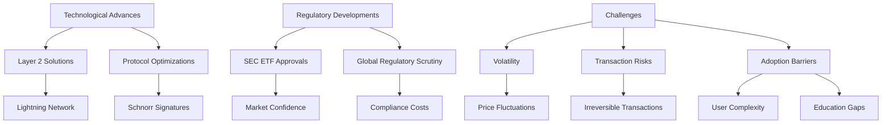

# Why has Bitcoin still not become widely adopted for everyday payments despite high global awareness?

- Breadth: 4
- Depth: 3
- Created: 2026-03-22 12:34:28
- Completed: 2026-03-22 12:35:38

## Introduction

Bitcoin emerged in 2008 as a decentralized digital currency designed to eliminate intermediaries in financial transactions, leveraging blockchain technology to ensure transparency and security [1]. Its initial promise centered on overcoming traditional financial systems' limitations, such as censorship resistance and inflationary pressures, while maintaining a fixed supply cap of 21 million coins [1]. Despite global awareness, Bitcoin's adoption for everyday payments remains limited due to structural and practical challenges. 

Scalability constraints, such as a maximum transaction throughput of 7-10 per second and a 10-minute block time, have hindered its ability to compete with traditional payment networks [2]. Additionally, its price volatility—exacerbated by a 12,872% increase from $500 in 2016 to $64,861 in 2024—has made it an unreliable medium for routine transactions [3]. The network's rigid protocol, resistant to rapid modifications, further complicates adaptations needed for mass adoption [1]. 

While layer 2 solutions like the Lightning Network aim to address scalability through off-chain transactions [2], broader adoption faces hurdles such as regulatory uncertainty and the absence of legal protections for transactions, which cannot be reversed [3]. These factors underscore the gap between Bitcoin's theoretical potential and its practical application in daily commerce.

## Adoption Barriers

Bitcoin's limited adoption for everyday payments stems from multifaceted challenges spanning technical, economic, and social dimensions. Technologically, Bitcoin's scalability issues persist due to its 1 MB block size limit and 10-minute block time, resulting in transaction throughput of only 7-10 per second [2]. This creates network congestion, driving up fees to levels that often exceed the value of small transactions, such as a $5 coffee [1]. The blockchain's design also lacks efficient off-chain solutions for mass adoption, exacerbating these bottlenecks [4].

Economically, price volatility and regulatory ambiguity deter both consumers and merchants. Bitcoin's value fluctuations make it an unreliable medium for everyday purchases, while inconsistent global regulations create compliance risks for businesses [5]. High fees during peak usage further alienate users, as seen in cases where transaction costs for small payments surpass the transaction value itself [6]. Additionally, the absence of reversible transactions removes consumer protections, increasing perceived risk [3].

Socially, adoption is hindered by limited merchant acceptance and user complexity. No centralized platform tracks Bitcoin-accepting businesses, forcing users to rely on fragmented sources [7]. User interfaces remain non-intuitive, and widespread education about Bitcoin's mechanics is lacking, contributing to its perception as a technical niche rather than a practical tool [1]. Security concerns, including wallet vulnerabilities and exchange risks, further erode trust in its everyday usability [8].

## Case Studies

El Salvador's adoption of Bitcoin as legal tender in 2021 represents a significant case study in institutionalizing cryptocurrency for everyday use. The government's initiative, supported by the Chivo wallet, aimed to integrate Bitcoin into financial systems, offering incentives for adoption. However, challenges such as technical barriers, regulatory uncertainty, and public skepticism limited its impact. For instance, the Bitcoin Beach project in El Zonte, which predated the legal tender law, demonstrated community-driven adoption through the Lightning Network, enabling microtransactions and local business integration [4]. This grassroots approach highlighted the potential of layer-2 solutions like the Lightning Network to address Bitcoin's scalability limitations, which remain a critical obstacle for widespread adoption [2].  

In contrast, El Salvador's broader implementation faced hurdles including internet infrastructure gaps, user education challenges, and resistance from traditional financial institutions. While the country's experiment provided insights into Bitcoin's viability as a national currency, it also underscored systemic issues such as volatility and regulatory risks [9]. Similar challenges persist in other regions, where fragmented adoption—evidenced by disparate directories like btcmap.org and lightningnetworkstores.com—reflects the lack of a unified ecosystem for Bitcoin payments [7].  

Technical constraints, such as Bitcoin's 7-10 transactions-per-second throughput and 10-minute block times, further hinder its utility for high-frequency, low-value transactions [2]. While innovations like Schnorr signatures and MAST aim to improve scalability, their adoption remains gradual [4]. Regulatory factors, including Canada's taxation policies and the SEC's ETF decisions, also shape adoption trajectories, creating a complex landscape for businesses and users [1], [5].  

These case studies reveal that while Bitcoin's technical and regulatory challenges are well-documented, its adoption remains uneven, driven by localized efforts rather than global scalability.

## Comparative Analysis

Bitcoin's adoption challenges share similarities with other digital payment systems but also exhibit unique technical and practical barriers. A comparative analysis reveals overlapping issues such as scalability and regulatory uncertainty, alongside Bitcoin-specific limitations in transaction design and user accessibility.  

**Shared Challenges**  
Both Bitcoin and systems like Ethereum face scalability constraints, with Bitcoin processing 7–10 transactions per second (TPS) and Ethereum handling 12–15 TPS, far below traditional payment networks like Visa’s 24,000 TPS [2], [10]. Network congestion and high fees during peak usage limit their viability for small, frequent purchases, a challenge also faced by other blockchains [8]. Regulatory scrutiny and taxation also affect multiple digital payment systems, creating compliance hurdles for merchants and users [1].  

**Unique Bitcoin Barriers**  
Bitcoin’s **push-based payment model** requires explicit user initiation for each transaction, complicating automated or recurring payments without off-chain solutions like the Lightning Network [11]. This contrasts with centralized systems like PayPal or Visa, which support seamless recurring billing. Additionally, Bitcoin’s protocol lacks native support for scheduled payments, forcing merchants to rely on third-party tools [11].  

Technical limitations further hinder adoption. Bitcoin’s 1 MB block size (up to 4 MB with SegWit) creates bottlenecks for high-frequency transactions, exacerbating network congestion [11]. While Layer 2 solutions like the Lightning Network aim to address scalability, their adoption remains limited, leaving on-chain transactions vulnerable to high fees and slow processing [4].  

**Merchant and User Accessibility**  
Unlike established digital payment systems, Bitcoin lacks a unified platform for tracking businesses that accept it, forcing users to rely on fragmented sources [7]. This fragmentation, combined with a complex user interface and limited education, reduces its practicality for everyday use compared to more user-friendly alternatives [1].  

**Volatility and Institutional Factors**  
While volatility is a shared concern across cryptocurrencies, Bitcoin’s price swings remain a critical barrier for merchants and consumers despite improvements by 2024 [5]. Regulatory uncertainty and the absence of a centralized authority also differentiate Bitcoin from traditional payment systems, where oversight provides predictability for users [5].  

This interplay of shared and unique challenges underscores why Bitcoin’s adoption for everyday payments lags behind both traditional systems and other digital alternatives, despite its global awareness.

## Technological and Regulatory Developments

Recent technological advancements and regulatory developments highlight both opportunities and challenges for Bitcoin's future adoption. On the technological front, scalability remains a critical issue, with Bitcoin's on-chain transaction throughput limited to 7–10 transactions per second and a 10-minute block time, creating bottlenecks as adoption grows [2]. Layer 2 solutions like the Lightning Network and rollups are seen as essential for supporting billions of users, while technical optimizations such as Schnorr signatures and MAST aim to improve efficiency [2][4]. However, high transaction fees on competing blockchains, such as Ethereum, during peak congestion periods also raise concerns about Bitcoin's practicality for small, frequent purchases [8].  

Regulatory developments present a dual-edged sword. While the U.S. Securities and Exchange Commission (SEC) approval of Bitcoin ETFs in 2024 could boost adoption and price stability [5], broader regulatory scrutiny—such as Canada's taxation policies and enforcement actions—introduces uncertainty [1]. Global regulatory activity is intensifying, reflecting growing institutional interest in digital assets [12].  

Key barriers persist, including Bitcoin's volatility, which remains a deterrent for everyday use despite reduced fluctuations in 2024 [5], and the lack of legal protections for irreversible transactions [3]. Additionally, the complexity of Bitcoin's user interface and limited public understanding of blockchain technology hinder accessibility [3][1]. These factors, combined with the absence of a unified system to track Bitcoin-accepting businesses, further complicate widespread adoption for daily transactions [7].  

## Conclusion

**Conclusion**  
Bitcoin's limited adoption for everyday payments stems from a confluence of technological, economic, and regulatory challenges that undermine its practicality despite its global awareness. Its design prioritizes security and decentralization, but this comes at the cost of scalability, with inherent limitations such as low transaction throughput, high fees, and prolonged confirmation times, rendering it inefficient for small, frequent transactions. Volatility further complicates its role as a stable medium of exchange, while the absence of reversible transactions and legal protections deters merchants and users. Although innovations like the Lightning Network offer scalability solutions, fragmented ecosystems, technical constraints, and regulatory uncertainties hinder widespread implementation. Comparative analysis reveals that Bitcoin faces unique trade-offs, including a rigid protocol resistant to changes and a push-based transaction model, which contrast with more adaptable digital payment systems. Key conditions for adoption—such as regulatory clarity, user-friendly interfaces, merchant acceptance, and public education—remain unmet, perpetuating its status as a speculative asset rather than a mainstream payment tool. While technological advancements and evolving regulatory frameworks may address some barriers, Bitcoin's current trajectory suggests that its economic viability for everyday use hinges on resolving these systemic challenges without compromising its core principles of decentralization and security.

## Sources

1. https://coindoo.com/bitcoins-biggest-limitations-explained-speed-fees-and-scalability/
2. https://www.xverse.app/blog/bitcoin-scalability
3. https://www.dreamstolifellc.com/major-hurdles-to-cryptocurrency-adoption-in-late-2024/
4. https://en.wikipedia.org/wiki/Bitcoin_scalability_problem
5. https://www.tastycrypto.com/blog/bitcoin-adoption/
6. https://www.coinmetro.com/learning-lab/blockchain-scalability-solutions
7. https://www.reddit.com/r/Bitcoin/comments/1cidouf/is_there_a_comprehensive_list_of_businesses_that/
8. https://finchtrade.com/blog/top-challenges-in-scaling-crypto-payment-services-in-2025
9. https://www.henleyglobal.com/publications/crypto-wealth-report-2024/case-nation-state-bitcoin-adoption-2024-and-beyond
10. https://hedera.com/learning/blockchain-scalability/
11. https://www.ccn.com/education/crypto/bitcoin-recurring-payments-possible-limitations/
12. https://kpmg.com/us/en/articles/2022/ten-key-regulatory-challenges-2022-crypto-digital-assets.html