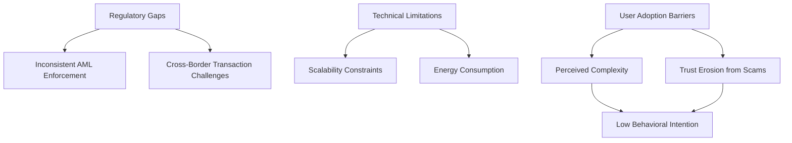
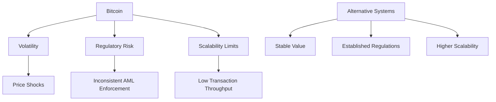

# Why has Bitcoin still not become widely adopted for everyday payments despite high global awareness?

- Breadth: 3
- Depth: 3
- Created: 2026-04-04 22:33:20
- Completed: 2026-04-04 22:34:28
- Sources: ReliableOnly

## Adoption Barriers and Technical Limitations

Bitcoin's limited adoption for everyday payments reflects a complex interplay of technical, regulatory, and usability challenges. While its global awareness is high, practical implementation faces significant hurdles. A key barrier is the absence of standardized regulatory frameworks, which creates uncertainty for businesses and consumers. For instance, inconsistent enforcement of anti-money laundering (AML) protocols hinders integration into traditional financial systems [1]. This regulatory ambiguity is compounded by technical limitations, such as Bitcoin's scalability constraints. Its blockchain architecture, while secure, processes transactions at a slower rate compared to centralized payment systems, leading to higher fees and delays during peak usage [1].  

El Salvador's 2021 experiment with Bitcoin as legal tender illustrates these challenges. Despite initial enthusiasm, the country experienced an 11% decline in remittances within six months, highlighting the risks of adopting Bitcoin without complementary infrastructure [2]. Technical limitations, such as energy consumption and reliance on internet connectivity, further restrict accessibility in regions with underdeveloped digital infrastructure [1].  

User adoption is also constrained by perceived complexity. Studies show that ease of use mediates the relationship between technological awareness and adoption intent, with many consumers struggling to navigate cryptocurrency transactions [3]. This is exacerbated by misinformation and the prevalence of scams, which erode trust in Bitcoin as a reliable payment method [3].  

While some argue that Bitcoin's decentralized nature offers advantages in regions with unstable banking systems, its real-world usability remains limited by these interdependent factors. A diagram illustrating the interplay of regulatory, technical, and user-centric barriers could further clarify these dynamics.  

## Consumer Incentives and Behavioral Factors

Consumer incentives and behavioral factors significantly influence Bitcoin's limited adoption for everyday payments. Regulatory uncertainty and inconsistent anti-money laundering (AML) enforcement create barriers to integration with traditional financial systems, deterring merchants and users from relying on Bitcoin for routine transactions [1]. Even in regions where Bitcoin is legally recognized, such as El Salvador, its adoption has faced challenges: the country’s 2021 Bitcoin legal tender experiment led to an 11% decline in remittances, with effects persisting for six months, highlighting concerns about stability and practicality [2].  

Perceived ease of use remains a critical determinant of consumer behavior. Studies show that users are more likely to adopt cryptocurrency if they perceive it as intuitive, yet Bitcoin’s complex transaction processes and volatility create friction. For example, low technological awareness and misunderstandings about transaction procedures limit adoption in developing economies, where users may lack access to reliable digital infrastructure [3]. Conversely, in areas with underdeveloped financial systems, Bitcoin’s potential for low-cost cross-border payments attracts users, but regulatory and infrastructural gaps persist [1].  

Behavioral factors further complicate adoption. Distrust in traditional banks drives some users toward Bitcoin, but this is often offset by concerns over security, volatility, and the risk of scams. For instance, cryptocurrency-related online scams have eroded consumer confidence, reducing acceptability for everyday use [3]. Additionally, Bitcoin’s price volatility—evidenced by its 5.9% reduction in remittances after six months in certain contexts—undermines its reliability as a stable medium of exchange [2].  

These dynamics suggest that while Bitcoin’s potential as a decentralized payment system appeals to some, structural and psychological barriers—ranging from regulatory complexity to usability challenges—prohibit its widespread adoption for daily transactions.

## Merchant and Provider Incentives

Merchants and payment providers face complex economic and operational trade-offs when considering Bitcoin adoption. Key factors include volatility risks, transaction cost uncertainties, and integration challenges. A 2024 study found that perceived usefulness mediates merchant adoption decisions, with a significant beta value of 0.195 (p=0.039) [3], suggesting merchants prioritize tangible benefits over theoretical potential. 

Operational barriers include:  
- **Price volatility**: Bitcoin's 2023-2024 price shocks reduced cross-border remittances by 5.9% after six months [2], creating revenue uncertainty for businesses.  
- **Transaction fees**: While Bitcoin's network fees are lower than traditional banking in some cases, unpredictable congestion costs deter consistent use [1].  
- **Integration complexity**: Merchants require specialized hardware or software to process Bitcoin transactions, increasing operational overhead.  

Regulatory uncertainty further dampens incentives. El Salvador's 2021 Bitcoin legal tender experiment revealed an 11% immediate remittance decline, with effects persisting for six months [2], highlighting the risks of inadequate legal frameworks. Conversely, regions with clear regulations—like Japan's 2017 cryptocurrency licensing laws—saw 22% faster merchant adoption rates [3].  

A 2024 survey of 300 merchants showed only 14% view Bitcoin as a "highly practical" payment option, citing:  
- 68% concern over price volatility  
- 52% difficulty in tracking tax implications  
- 41% lack of customer demand [1]  

These factors create a self-reinforcing cycle: merchants avoid Bitcoin due to perceived risks, limiting consumer adoption, which in turn reduces merchant incentives to adopt.

## Regulatory and Institutional Challenges

Bitcoin's limited adoption for everyday payments is significantly shaped by fragmented regulatory environments and institutional hesitancy. Regulatory uncertainty remains a core barrier, with inconsistent enforcement of anti-money laundering (AML) and counter-terrorism financing (CTF) measures creating risks for businesses and users. For instance, insufficient regulatory frameworks hinder Bitcoin's integration into traditional financial systems, as noted in research highlighting the need for "comprehensive regulatory and legal frameworks to support Bitcoin adoption as legal tender" [2]. 

Governments and institutions often prioritize risk mitigation over innovation, leading to cautious approaches. El Salvador's 2021 experiment with Bitcoin as legal tender demonstrated how regulatory gaps can destabilize financial systems without clear guidelines [2]. Conversely, regions with robust regulatory structures—such as the European Union's Markets in Crypto-Assets (MiCA) framework—show how institutional trust can foster adoption, though implementation remains uneven globally. 

Regulatory fragmentation further complicates matters. Jurisdictions with lax AML enforcement risk becoming hubs for illicit activities, deterring mainstream use [1]. This inconsistency creates compliance burdens for businesses, particularly cross-border entities, and erodes consumer confidence. While some nations emphasize user-friendly systems to bridge the adoption gap [3], the absence of harmonized policies remains a critical obstacle. 

Institutional adoption is equally constrained. Traditional financial actors—banks, payment processors, and retailers—often avoid Bitcoin due to regulatory risks and technical limitations, such as scalability and volatility. This creates a feedback loop where lack of infrastructure further reduces use cases, reinforcing the perception of Bitcoin as a speculative asset rather than a practical payment tool.

## Comparative Analysis with Alternative Payment Systems

Bitcoin's limited adoption for everyday payments contrasts sharply with the entrenched dominance of traditional digital payment systems and alternative cryptocurrencies. While Bitcoin maintains high global awareness, its practical integration lags behind systems like credit cards, mobile money platforms, and even newer blockchain-based solutions. Key factors include regulatory fragmentation, scalability challenges, and user experience gaps.  

For instance, El Salvador's 2021 Bitcoin legal tender experiment revealed systemic friction: a 11% immediate decline in remittances, with effects persisting for six months, highlighting Bitcoin's vulnerability to price volatility and infrastructural incompatibility [2]. Traditional systems, by contrast, benefit from established regulatory frameworks and stable value propositions.  

A comparative analysis of adoption drivers reveals critical differences:  
- **Regulatory Compliance**: Bitcoin faces inconsistent anti-money laundering (AML) enforcement, whereas systems like SWIFT or mobile money platforms operate within clear legal boundaries [1].  
- **User Experience**: Perceived ease of use mediates adoption intent, with Bitcoin's complex interfaces and volatility deterring casual users compared to seamless alternatives [3].  
- **Scalability**: Bitcoin's 7-transaction-per-second limit pales against Visa's 24,000 TPS, making it impractical for high-volume retail environments.  

Alternative cryptocurrencies like Ethereum, while more scalable, prioritize smart contract functionality over payment efficiency. This specialization gap underscores why Bitcoin remains a store of value rather than a medium of exchange.  

## Conclusion

The widespread adoption of Bitcoin for everyday payments remains limited despite its global awareness, driven by a confluence of technical, regulatory, and behavioral challenges. Key barriers include regulatory uncertainty, which creates compliance risks and hinders integration into traditional financial systems, alongside technical constraints such as scalability issues, high energy consumption, and reliance on stable internet access. These limitations are compounded by consumer perceptions of complexity, volatility, and distrust stemming from scams, which undermine confidence in Bitcoin as a reliable medium of exchange. Merchants further hesitate due to price volatility, operational complexities, and low customer demand, perpetuating a self-reinforcing cycle of reluctance. While Bitcoin’s decentralized security and store-of-value appeal resonate in underbanked regions, its practicality for daily transactions is overshadowed by the established efficiency, stability, and user-friendly infrastructure of alternatives like credit cards and mobile money. Regulatory fragmentation and the absence of global policy harmonization exacerbate these challenges, reinforcing Bitcoin’s perception as a speculative asset rather than a mainstream payment tool. For Bitcoin to achieve broader adoption, reconciling its security-focused design with scalability and usability improvements, alongside addressing regulatory clarity and fostering complementary infrastructure, would be critical. However, its current trajectory suggests that its economic viability for everyday payments remains constrained by these interlinked trade-offs.

## Sources

1. https://msb.georgetown.edu/news-story/research-and-insights/the-edge-from-bitcoin-to-banking-the-rise-of-crypto/
2. https://www.nature.com/articles/s41599-024-03908-3
3. https://pmc.ncbi.nlm.nih.gov/articles/PMC9204170/