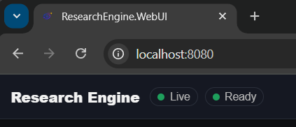
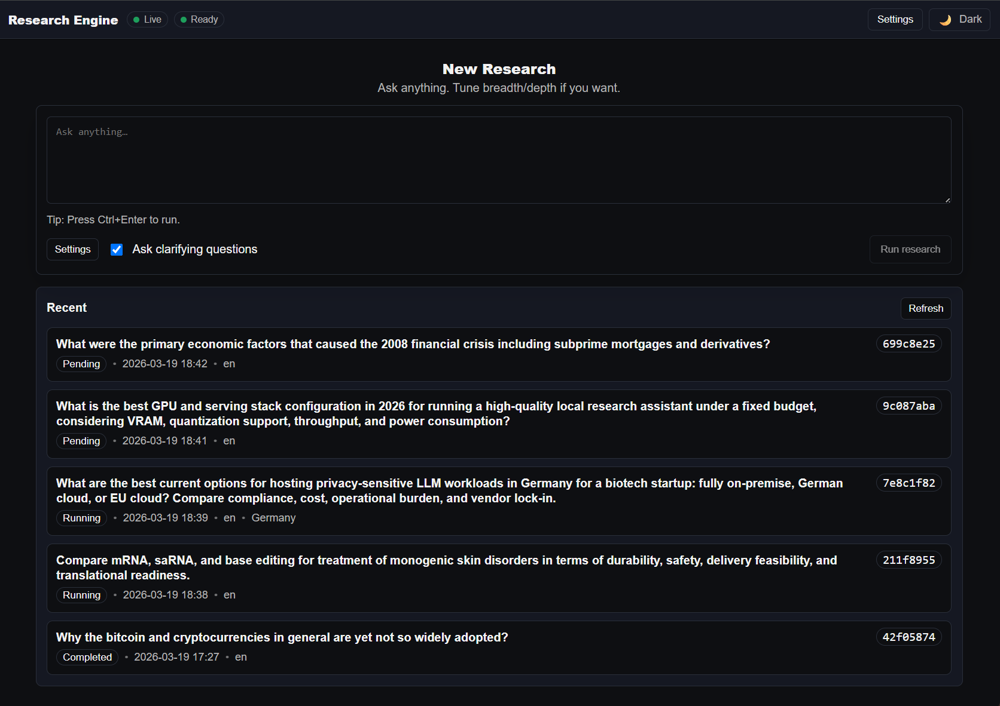
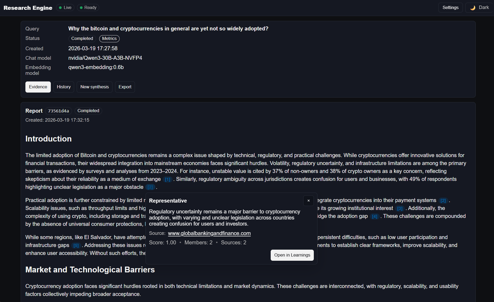
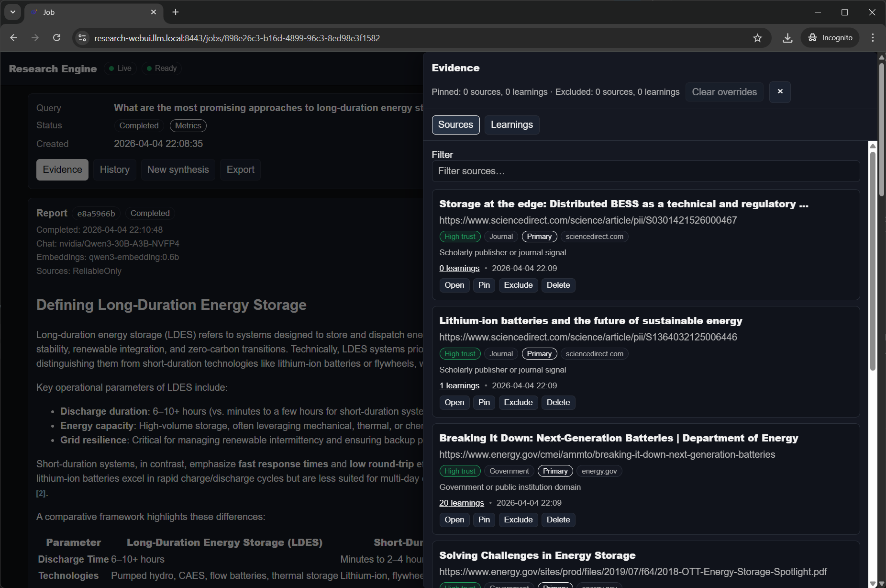
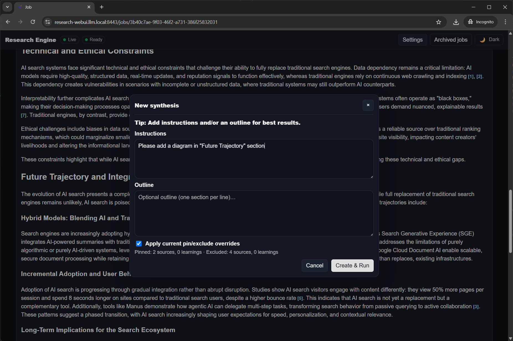
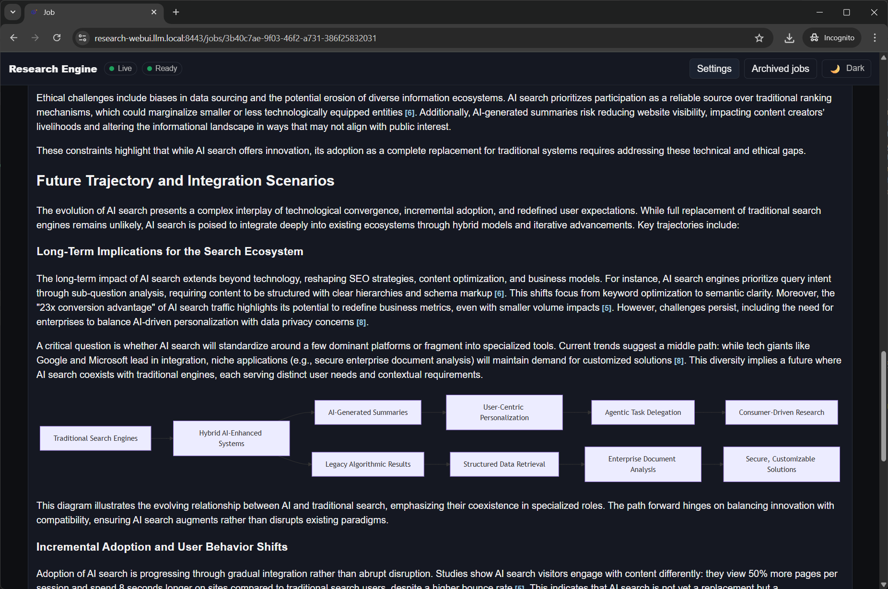

<p align="center">
  
</p>

<p align="center">
  <strong>Local-first deep research.</strong>
</p>

<p align="center">
  Research Engine collects web evidence, distills it into structured learnings, and generates cited research reports through an inspectable retrieval-based synthesis pipeline.
</p>

<p align="center">
  <a href="./Docs/Architecture.md">Architecture</a>
  ·
  <a href="./Docs/Deployment.md">Deployment</a>
  ·
  <a href="./Docs/Configuration.md">Configuration</a>
</p>

Research Engine is built for individual researchers and small teams who want private, inspectable, and controllable research workflows on local infrastructure instead of cloud-only systems.

No subscription required. Your prompts, sources, and reports stay on infrastructure you control.

<p align="center">
  
</p>

<p align="center">
  The Web UI lets you start research jobs, track progress, inspect evidence, and work with cited reports from one workspace.
</p>

## Main features

- **Local-first deep research** using locally hosted chat and embedding models
- **Privacy-oriented by design** so prompts, sources, and generated reports remain under your control
- **Configurable source discovery modes** with `Auto`, `Balanced`, `Reliable only`, and `Academic only` policies
- **Deterministic source reliability** using a global trust pack plus region-aware rule packs selected from the job language and region
- **Traceable citations** with source URLs and evidence popovers in the final report
- **Interactive evidence review** for inspecting sources, learnings, and reliability badges before accepting a synthesis
- **Pin and exclude workflow** for curating evidence without restarting the full job
- **Regeneration with extra instructions** to refine a report from the existing research set

## Super Quick Start

The app is containerized. You don't need Linux or Mac - it will just work on your Windows 11 gaming PC. It was tested on this configuration:

- CPU: AMD Ryzen 7940HX (16 cores)
- RAM: 32 GB DDR5 5200
- GPU: **Nvidia RTX 5090** *--works with less beefy GPU ofc!*
- OS: Windows 11 with WSL2
- Containers: Podman Desktop
- [GPU container access](https://podman-desktop.io/docs/podman/gpu) is configured. 

The main requirement is that system must be powerful enough to run at least 8-14B models with a decent speed and context window. 

If your hardware is different, or you want HTTPS and a friendly local URL such as `https://research-webui.llm.local:8443`, see the [Deployment guide](./Docs/Deployment.md).

If you have a similar PC, you can use this one-command installer flow:

```bash
git clone https://github.com/EAValov/research-engine.git
cd research-engine
powershell -File .\Deploy\single-host.ps1 up
```

That command builds the local `research-api` and `research-webui` images and then deploys the full single-host stack.

Then open:

```text
http://localhost:8080
```

Wait until the `Live` and `Ready` indicators are green - this means that LLM server is ready.



At that point the app is ready to use. Good luck with your research!

Optional but recommended: if you want the friendly HTTPS URL, add this hosts entry:

```text
127.0.0.1 research-webui.llm.local
```

Then run:

```bash
powershell -File .\Deploy\single-host.ps1 up -InstallCaddyCertificate
```

Installing the Caddy certificate is optional, but recommended. It is safe in the normal local-development sense: the script trusts the local CA generated by your own Caddy container so Windows and your browser accept `https://research-webui.llm.local:8443` without warnings.

## How It Works

1. Submit a research query.
2. The system searches the web using the selected source-discovery policy and collects source pages.
3. Sources are classified for reliability using deterministic global and regional trust rules, then pages are compressed into structured learnings and stored in PostgreSQL with embeddings.
4. The LLM plans and writes the report section by section using retrieval.
5. You review citations and evidence in the UI.
6. You regenerate with pinned or excluded evidence and extra instructions.

## Source Discovery Modes

Research Engine can bias web discovery before pages are scraped.

- **Auto** lets the protocol choose the best discovery mode for the query.
- **Balanced** mixes broad discovery with deterministic source-quality heuristics.
- **Reliable only** keeps higher-trust sources such as official statements, government pages, academic material, journals, and established publications.
- **Academic only** focuses discovery on research-oriented sources such as academic domains, journals, and preprints.

Global trust rules are always applied. When a job language or human-readable region string matches a known locale, the matching regional pack is added on top. The built-in packs currently include `Russia` and `China`.

The default mode is set in the Settings dialog and can be overridden per job from the composer. Stored sources keep source class, reliability tier, and rationale so the evidence drawer can explain why a source was promoted or demoted. Trust packs are currently code-defined rather than editable from the UI.

## Example Reports

- [Most promising approaches to long-duration energy storage](<./Examples/Long-duration energy storage.md>)
- [Market opportunities for launching an AI-powered consumer health app](<./Examples/Health app in the EU and US.md>)
- [Why Bitcoin is still not widely adopted](<./Examples/Why Bitcoin still not widely adopted.md>)
- [Will AI replace the traditional search engines?](<./Examples/AI and the traditional search engines.md>)
- [Europe’s Housing Crisis explained](<./Examples/Europe’s Housing Crisis.md>)

## Screenshots

<details>
  <summary>Open screenshot gallery</summary>

  <table>
    <tr>
      <td align="center" width="50%">
        <strong>Main research workspace</strong><br><br>
        <br><br>
        Start new research runs, tune scope and source policy, and monitor recent jobs from one workspace.
      </td>
      <td align="center" width="50%">
        <strong>Generated synthesis with citations</strong><br><br>
        <br><br>
        Review a completed report with inline citations, evidence popovers, export tools, and the entry point for regeneration.
      </td>
    </tr>
    <tr>
      <td align="center" width="50%">
        <strong>Evidence drawer and curation workflow</strong><br><br>
        <br><br>
        Inspect sources, reliability metadata, and learnings, then pin or exclude evidence before generating the next synthesis iteration.
      </td>
      <td align="center" width="50%">
        <strong>Regeneration UI</strong><br><br>
        <br><br>
        Create a new synthesis with additional instructions and pinned or excluded evidence overrides.
      </td>
    </tr>
  </table>

  <p align="center" width="50%">
    <strong>Regenerated Synthesis Result</strong>
  </p>

  <p align="center">
    
  </p>

  <p align="center">
    The regenerated report keeps the citation-driven reading experience while reflecting the new synthesis instructions and curated evidence set.
  </p>
</details>

## How is it different?

Cloud deep research systems usually rely on very large hosted models and very large context windows. That works well in a datacenter, but it does not translate cleanly to local models running on consumer hardware.

Research Engine takes a more context-efficient path. Instead of treating scraped pages as raw prompt material, it turns them into structured learnings, stores them, and retrieves only the evidence needed for each report section.

That trade-off makes the system more inspectable and easier to control on local infrastructure. It also makes the evidence layer reusable, so you can review, pin, exclude, and regenerate without rerunning the whole research job.

For the deeper architecture walkthrough, see the [Architecture guide](./Docs/Architecture.md).

## Documentation

- [Architecture](./Docs/Architecture.md) - how evidence collection and synthesis fit together
- [Deployment](./Docs/Deployment.md) - single-host setup, pod layout, and backend choices
- [Configuration](./Docs/Configuration.md) - runtime settings, environment variables, and live-editable options

## License

This project is licensed under the **GNU Affero General Public License v3.0 (AGPL-3.0)**. If you run a modified networked version, you must make the source for that modified version available under the same license.

See [LICENSE](./LICENSE) for details.

## Citation

If you use Research Engine in academic work, benchmarks, or comparative evaluations, please cite it using the repository citation metadata in [`CITATION.cff`](./CITATION.cff).
