# Research Engine

Research Engine is a local-first deep research application that uses a locally hosted LLM to collect web learnings, store them as structured evidence, and generate cited research reports through a retrieval-based synthesis pipeline. It is designed for users who want private, inspectable, and controllable research workflows running on local infrastructure rather than opaque cloud-only systems.

Unlike cloud-based deep research tools that compress scraped pages into one large prompt, Research Engine converts web findings into reusable learnings, stores them in a database with vector search, and uses retrieval during synthesis generation. This makes it possible to produce strong reports even with smaller local models and limited context windows.

## Approach

Research Engine is built around a different architecture than typical cloud-based deep research systems.

Many cloud-based tools perform research by spawning agents, collecting and scraping pages, combining large amounts of source content into a single prompt, and sending that prompt to a large cloud model to generate the final report. This works well when very large models and very large context windows are available, but it is less suitable for smaller local models.

Research Engine is designed to be more context-efficient. Instead of treating scraped pages as final prompt material, it transforms research results into compact structured learnings, stores them in a database, and retrieves only the most relevant evidence during synthesis generation. The final report is written section by section through a RAG-based pipeline, which helps smaller local models produce better results without requiring the full research corpus in context at once.

This architecture also enables an interactive evidence workflow. Users can inspect the sources and learnings used by the model, verify citations, pin or exclude evidence, and regenerate the synthesis with additional instructions without rerunning the whole research job from scratch.

## Architecture

Research Engine separates research collection, knowledge storage, synthesis generation, and evidence review into distinct stages. Instead of feeding all scraped content into one large prompt, it stores reusable learnings and retrieves only the relevant evidence during section-based synthesis generation.

```mermaid
flowchart LR
    %% --- User Layer ---
    U[User Query<br/>+ Optional Clarifications]

    %% --- Research Layer ---
    subgraph R[Research Pipeline]
        direction LR
        R1[Query Expansion<br/>SERP Generation]
        R2[Web Research<br/>Source Collection]
        R3[Learning Extraction<br/>Structured Learnings]
    end

    %% --- Knowledge Layer ---
    subgraph K[Knowledge Layer]
        direction TB
        K1[(Learnings Database)]
        K2[(Vector Search Index)]
    end

    %% --- Synthesis Layer ---
    subgraph S[Synthesis Pipeline]
        direction LR
        S1[Section Planning<br/>Local LLM]
        S2[Retrieval per Section<br/>Relevant Learnings]
        S3[Section Writing<br/>Cited Synthesis]
    end

    %% --- Review Layer ---
    subgraph V[Interactive Review]
        direction LR
        V1[Final Report<br/>Clickable Citations]
        V2[Evidence Review<br/>Sources + Learning Text]
        V3[User Curation<br/>Pin / Exclude / Instructions]
    end

    %% --- Main Flow ---
    U --> R1
    R1 --> R2
    R2 --> R3
    R3 --> K1
    K1 --> K2
    K2 --> S1
    S1 --> S2
    S2 --> S3
    S3 --> V1
    V1 --> V2
    V2 --> V3

    %% --- Regeneration Loop ---
    V3 -. Regenerate synthesis without rerunning research .-> S1

    %% --- Styling ---
    classDef user fill:#EAF3FF,stroke:#4A90E2,stroke-width:1.5,color:#111;
    classDef research fill:#EEF7EE,stroke:#53A653,stroke-width:1.2,color:#111;
    classDef knowledge fill:#FFF8E7,stroke:#D4A72C,stroke-width:1.2,color:#111;
    classDef synthesis fill:#F3EEFF,stroke:#8A63D2,stroke-width:1.2,color:#111;
    classDef review fill:#FFF0F3,stroke:#D96C8A,stroke-width:1.2,color:#111;

    class U user;
    class R1,R2,R3 research;
    class K1,K2 knowledge;
    class S1,S2,S3 synthesis;
    class V1,V2,V3 review;
```



## Key Features

- **Local-first deep research**
  - Uses a locally hosted LLM instead of requiring a cloud model

- **Privacy-oriented design**
  - Built to run locally so research workflows, prompts, and generated reports can stay under the user’s control

- **Learning extraction pipeline**
  - Converts search results and web content into structured reusable learnings

- **RAG-based synthesis generation**
  - Generates report sections using vector-retrieved learnings from the database

- **Interactive evidence review**
  - Inspect sources and learnings used by the model
  - Click citations in the final report to verify supporting evidence

- **Pin / exclude workflow**
  - Pin valuable sources or learnings
  - Exclude weak or irrelevant evidence
  - Regenerate the report using curated evidence instead of starting over

- **Regeneration with additional instructions**
  - Refine the synthesis with extra directions for the model
  - Improve report quality without rerunning the full research collection pipeline

- **Traceable citations**
  - Reports include clickable citations
  - Users can inspect the original source URL and the exact learning text used in synthesis

## How it Works

1. The user submits a research query  
   Optional clarifications can be added to steer the research scope.

2. The system performs web research  
   Search queries are generated and SERP/web content is collected.

3. The system extracts learnings  
   Web content is transformed into structured learnings rather than kept as raw long-form prompt context.

4. Learnings are stored in the database  
   The database supports vector search for later retrieval.

5. The LLM plans the report structure  
   It generates synthesis sections based on the collected research space.

6. Each section is written with retrieval  
   Relevant learnings are fetched from the database through vector search and supplied to the model as evidence.

7. The user reviews the result  
   The final report contains citations linked to sources and learnings.

8. The user curates evidence and regenerates  
   Sources and learnings can be pinned or excluded, and the synthesis can be regenerated with additional instructions.

## Screenshots

> Add UI screenshots here:
>
> - main research page
> - generated synthesis view
> - citation / evidence drawer
> - pin / exclude workflow
> - regeneration UI

## Example Reports

Example generated reports are included in the repository:

- [Example Report 1](./examples/report-1.md)
- [Example Report 2](./examples/report-2.md)
- [Example Report 3](./examples/report-3.md)

These examples show the kind of cited synthesis output that Research Engine produces.

## Installation

The recommended way to run Research Engine is with **Podman** using `podman kube play`.

A deployment example will be provided for:

- Windows 11
- WSL2
- NVIDIA drivers installed
- Podman available on the host

This setup downloads the required containers from public registries and runs the full application locally.

### Quick Start

```bash
podman kube play .\deploy\research-engine.yaml
```

Once the containers are running, open your browser and navigate to:

```text
http://localhost
```

## Requirements

The exact configuration options are documented separately, but the intended local setup is:

- Windows 11
- WSL2
- NVIDIA drivers
- Podman / Podman Desktop
- a compatible local LLM backend
- enough GPU memory / compute for the selected model

## Configuration

Configuration values and deployment details are documented separately.

See:

- [Configuration Guide](./docs/configuration.md)
- [Deployment Guide](./docs/deployment.md)

## Repository Structure

- `src/` - application source code
- `docs/` - documentation
- `deploy/` - deployment manifests
- `examples/` - example generated reports

## License

This project is licensed under the **GNU Affero General Public License v3.0 (AGPL-3.0)**.

The AGPL license ensures that if the software is modified and used to provide a network-accessible service, the corresponding source code of that modified version must also be made available under the same license.

See [LICENSE](./LICENSE) for details.

## Why AGPL-3.0?

Research Engine is intended to be open and remain open.

If someone adapts the project and runs it as a networked service, they should also share the source code of that adapted version. AGPL-3.0 supports this goal and helps ensure that improvements made to hosted versions of the software remain available to users.

## Contributing

Contributions, ideas, and feedback are welcome.

Please read [CONTRIBUTING.md](./CONTRIBUTING.md) before opening issues or pull requests.

## Security

If you discover a security issue, please see [SECURITY.md](./SECURITY.md).

## Citation

If you use Research Engine in academic work, benchmarks, or comparative evaluations, please cite it using the repository citation metadata in [`CITATION.cff`](./CITATION.cff).
