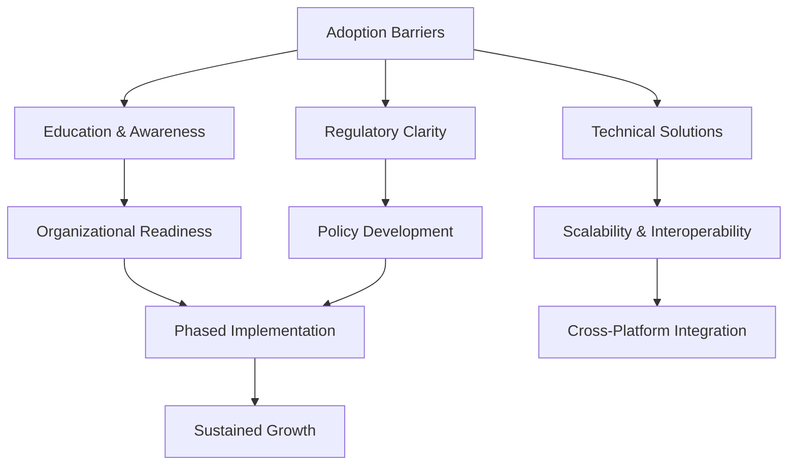

## Introduction

Blockchain technology, characterized by its decentralized, immutable, and transparent ledger system, has been heralded as a disruptive force across industries, promising to redefine trust, security, and efficiency in digital interactions. However, its adoption remains limited despite significant investment and research. This report investigates the barriers to blockchain's widespread implementation and the conditions required to overcome them. Key challenges include technical constraints such as scalability limitations, infrastructure gaps, and energy consumption, as well as systemic issues like the need for multi-party ecosystem participation [1]. Additionally, resistance from entrenched centralized systems, regulatory ambiguities, and the complexity of integrating blockchain with legacy technologies further impede progress. By synthesizing these factors, the report aims to clarify the path toward blockchain’s mainstream adoption, emphasizing the interplay between technological innovation, institutional readiness, and economic incentives.

## Current State of Blockchain Adoption

Blockchain adoption remains fragmented, with significant disparities across industries. While some sectors like finance and supply chain have explored blockchain solutions, widespread implementation is hindered by technical, organizational, and regulatory challenges. Healthcare, agriculture, and logistics—industries with high potential for blockchain disruption—still exhibit limited adoption due to factors such as system complexity, resistance to decentralization, and unclear ROI. For example, blockchain's decentralized nature directly challenges existing centralized systems, creating friction in sectors reliant on legacy infrastructure [2].  

Organizational awareness of blockchain's benefits is growing, but this awareness alone does not overcome practical barriers. Many businesses struggle to justify implementation costs without demonstrable, immediate value, particularly when traditional systems suffice for existing workflows [3]. Regulatory uncertainty further complicates adoption, as compliance requirements vary widely across regions and industries, deterring risk-averse organizations [4].  

Technical limitations also persist. Blockchain systems often require significant changes to existing processes, and their complexity creates a steep learning curve for stakeholders unfamiliar with distributed ledger technologies [5]. Additionally, interoperability issues between blockchain platforms and legacy systems hinder seamless integration, reducing adoption rates in sectors where compatibility with older technologies is critical [6].  

Despite these challenges, some industries are making progress. Enterprise adoption is rising due to user-friendly development frameworks and cloud-based blockchain services, which lower entry barriers [7]. However, this growth is concentrated in tech-savvy sectors, leaving traditional industries—such as manufacturing and public administration—behind. These sectors often lack the digital infrastructure or expertise to leverage blockchain effectively, exacerbating the adoption gap.  

The path to broader blockchain adoption requires addressing these multifaceted challenges through tailored policies, improved interoperability standards, and clearer use-case definitions that highlight tangible benefits over traditional systems [8].

## Technical and Regulatory Challenges

Blockchain adoption faces significant technical and regulatory challenges, with scalability, interoperability, and regulatory uncertainty emerging as critical barriers. Scalability limitations are compounded by outdated IT infrastructures and the inherent complexity of integrating decentralized systems with legacy frameworks [9], [10]. While interoperability challenges are widely acknowledged as a hurdle, evidence specifically linking them to adoption delays is limited, suggesting a need for further research.  

Regulatory hurdles dominate discussions on blockchain adoption, with inconsistent global standards creating compliance complexities. Jurisdictions struggle to define frameworks for digital assets, leading to uncertainty around anti-money laundering (AML) and know-your-customer (KYC) requirements [11], [12]. This regulatory fragmentation forces companies to navigate patchwork rules, delaying implementation until clearer guidelines are established [13], [14]. Additionally, the absence of government support in emerging economies exacerbates adoption gaps [15].  

Technical complexity and resistance to change further hinder progress. Blockchain’s decentralized nature disrupts existing centralized systems, requiring substantial investment in education and integration [10], [16]. Without clear advantages over traditional systems, organizations lack incentives to adopt the technology [17]. These challenges collectively underscore the need for coordinated technical innovation and regulatory harmonization to unlock blockchain’s potential.

## Case Studies of Successful Implementation

The implementation of blockchain in real-world scenarios has shown varying degrees of success, often hinging on specific contextual factors. One notable example is the use of blockchain in supply chain management, where structured approaches to implementation have proven critical. A study emphasizing the need for phased adoption highlighted that starting with low-risk pilots, such as document exchange in intellectual property offices, allowed organizations to build expertise before scaling up [18]. This aligns with broader observations that organizational awareness and strategic planning significantly influence the viability of blockchain initiatives [3].  

In the logistics sector, blockchain's success has been tied to cross-platform collaboration. For instance, integrating blockchain solutions with existing workflows required real-time communication tools to ensure seamless interoperability between systems [6]. Similarly, the tokenization of physical assets—such as in agriculture or real estate—demonstrates how blockchain can enable trustless value exchange through digital representations of tangible goods [19]. However, these successes often depend on addressing technical and non-technical barriers, including cybersecurity measures like smart contract audits [20].  

Another factor is the demonstration of tangible benefits. Blockchain initiatives in healthcare and agriculture have gained traction by showcasing clear advantages, such as reduced fraud or increased transparency [21]. Conversely, many projects failed due to misaligned incentives, lack of expertise, or insufficient market demand [22]. These insights underscore that blockchain's adoption is not solely a technological challenge but requires alignment with business goals, stakeholder education, and adaptive governance frameworks [23].

## Requirements for Widespread Adoption

The widespread adoption of blockchain technology hinges on addressing a confluence of technological, regulatory, and cultural challenges. These factors interact in complex ways, requiring coordinated solutions to overcome existing barriers.  

### Technological Requirements  
Blockchain adoption faces significant technical hurdles, including system complexity, scalability limitations, and the need for specialized expertise. The inherent trade-offs between decentralization, security, and scalability [24] complicate implementation, while the learning curve for new users and organizations creates friction [5]. Additionally, the lack of skilled personnel in blockchain development, cybersecurity, and data analytics acts as a critical bottleneck [25]. Addressing these issues demands investments in education, tooling, and infrastructure to reduce entry barriers.  

### Regulatory Challenges  
Regulatory uncertainty remains a major obstacle, with inconsistent global standards creating compliance difficulties for multinational enterprises [13]. Jurisdictions struggle to balance innovation with consumer protection, leading to fragmented rules around data privacy (e.g., GDPR) [26], anti-money laundering (AML), and know-your-customer (KYC) requirements. Without harmonized frameworks, businesses face heightened legal risks, slowing adoption [27].  

### Cultural and Organizational Factors  
Cultural resistance to change, organizational inertia, and fear of disrupting existing systems further hinder adoption. SMEs, in particular, exhibit strong technological resistance due to perceived risks and lack of understanding [28]. The decentralizing nature of blockchain also threatens centralized business models, requiring societal and industrial shifts to gain acceptance [2]. Furthermore, the network effect—where blockchain’s utility depends on broad participation—creates a chicken-and-egg problem for early adopters [29].  

### Interconnected Barriers  
These factors are interdependent. For example, regulatory ambiguity exacerbates technological hesitancy, while cultural resistance can delay the development of necessary technical standards. Future research emphasizes the need to model these interactions to design effective intervention strategies [30]. Without addressing these multifaceted challenges, blockchain’s potential to achieve mainstream adoption remains constrained.

## Future Prospects and Recommendations

The path to widespread blockchain adoption requires addressing technical, regulatory, and organizational challenges through targeted strategies. Future prospects hinge on overcoming these barriers, with recommendations emphasizing education, incremental implementation, and cross-sector collaboration.  

Key recommendations include:  
- **Phased Implementation**: Start with low-risk pilots, such as document exchange in intellectual property systems, to build expertise and demonstrate value [18]. This approach reduces complexity and allows organizations to scale solutions gradually.  
- **Enhanced Education and Awareness**: Public and organizational confusion about blockchain’s benefits persists, necessitating clear communication to foster acceptance [31]. Training programs can mitigate resistance by improving technological literacy.  
- **Policy and Regulatory Clarity**: Sector-specific and region-specific policies are critical to address variability in adoption barriers [8]. Streamlined compliance frameworks would reduce uncertainty for businesses.  
- **Interoperability Solutions**: Addressing interoperability between blockchain protocols and legacy systems is essential for seamless integration [32]. Standardized communication tools can bridge this gap.  

Technical challenges, such as scalability and energy consumption, remain significant. However, projections indicate growth, with Gartner estimating blockchain adoption will rise from 8% in 2023 to 46% by 2025 [33]. This suggests that while current limitations persist, ongoing innovation could mitigate these issues.  

A critical hurdle is the lack of clear advantages over traditional systems in most use cases [17]. To overcome this, stakeholders must prioritize applications where blockchain’s unique properties—such as decentralization and immutability—deliver measurable value. Additionally, resistance from centralized systems requires long-term societal and industrial adaptation [2].  

By combining incremental adoption, policy advocacy, and technical refinement, blockchain’s potential can be realized. The following diagram outlines a conceptual framework for this process:  

## Conclusion

**Conclusion**  
Blockchain's limited adoption stems from a confluence of technical, regulatory, and cultural challenges that hinder its integration into mainstream systems. Technical constraints such as scalability limitations, energy consumption, and interoperability issues create practical barriers, while regulatory fragmentation and unclear compliance frameworks exacerbate uncertainty. Additionally, resistance from entrenched centralized systems, organizational inertia, and the complexity of transitioning from legacy infrastructure further delay widespread implementation. Despite progress in niche sectors, the absence of universally applicable use cases and measurable ROI complicates economic viability.  

To achieve mainstream adoption, coordinated efforts are required to address these interdependent challenges. Incremental, low-risk pilots—such as document exchange or asset tokenization—can demonstrate value while building expertise. Technological advancements in scalability, energy efficiency, and interoperability must align with sector-specific policies to reduce compliance risks and enable seamless integration. Equally critical is fostering cultural shifts through education, stakeholder collaboration, and adaptive governance to mitigate resistance. While trade-offs between innovation and legacy systems, as well as regulatory flexibility versus standardization, persist, the path to adoption hinges on balancing these factors. Ultimately, blockchain's economic viability depends on tailored solutions that harmonize technical progress, regulatory clarity, and organizational readiness, ensuring its benefits outweigh the costs of transition.

## Sources

1. https://www.techtarget.com/searchcio/tip/5-challenges-with-blockchain-adoption-and-how-to-avoid-them
2. https://www.reddit.com/r/ethereum/comments/1ax4eeu/why_we_dont_see_blockchain_appear_in_other/
3. https://www.techtarget.com/searchcio/tip/5-challenges-with-blockchain-adoption-and-how-to-avoid-them
4. https://pmc.ncbi.nlm.nih.gov/articles/PMC10112326/
5. https://pmc.ncbi.nlm.nih.gov/articles/PMC10112326/
6. https://webisoft.com/articles/disadvantages-of-blockchain/
7. https://webisoft.com/articles/disadvantages-of-blockchain/
8. https://journals.sagepub.com/doi/10.1177/21582440251367622
9. https://pmc.ncbi.nlm.nih.gov/articles/PMC10112326/
10. https://www.linkedin.com/pulse/limitations-challenges-blockchain-technology-build-my-dapp-iduzf
11. https://webisoft.com/articles/disadvantages-of-blockchain/
12. https://www.techtarget.com/searchcio/tip/5-challenges-with-blockchain-adoption-and-how-to-avoid-them
13. https://helalabs.com/blog/challenges-in-blockchain-adoption/
14. https://www.linkedin.com/pulse/limitations-challenges-blockchain-technology-build-my-dapp-iduzf
15. https://journals.sagepub.com/doi/10.1177/21582440251367622
16. https://www.linkedin.com/pulse/unpacking-hype-why-blockchain-hasnt-captured-publics-altug-tatlisu-me7cf/
17. https://www.reddit.com/r/CryptoTechnology/comments/1nt3upj/why_isnt_blockchain_used_more_often/
18. https://acr-journal.com/article/a-comprehensive-analysis-of-blockchain-adoption-barriers-and-strategic-implementation-framework-for-intellectual-property-rights-protection-1835/
19. https://medium.com/evan-network/six-core-requirements-you-should-consider-in-choosing-the-a-blockchain-technology-e4fce36a1e58
20. https://webisoft.com/articles/disadvantages-of-blockchain/
21. https://www.linkedin.com/pulse/unpacking-hype-why-blockchain-hasnt-captured-publics-altug-tatlisu-me7cf/
22. https://www.reddit.com/r/ethereum/comments/1ax4eeu/why_we_dont_see_blockchain_appear_in_other/
23. https://pmc.ncbi.nlm.nih.gov/articles/PMC10112326/
24. https://pmc.ncbi.nlm.nih.gov/articles/PMC10112326/
25. https://journals.sagepub.com/doi/10.1177/21582440251367622
26. https://medium.com/evan-network/six-core-requirements-you-should-consider-in-choosing-the-a-blockchain-technology-e4fce36a1e58
27. https://www.reddit.com/r/CryptoTechnology/comments/1bs40ki/how_can_i_become_a_blockchain_developer/
28. https://journals.sagepub.com/doi/10.1177/21582440251367622
29. https://www.reddit.com/r/CryptoTechnology/comments/1nt3upj/why_isnt_blockchain_used_more_often/
30. https://journals.sagepub.com/doi/10.1177/21582440251367622
31. https://www.linkedin.com/pulse/unpacking-hype-why-blockchain-hasnt-captured-publics-altug-tatlisu-me7cf/
32. https://pmc.ncbi.nlm.nih.gov/articles/PMC10112326/
33. https://www.techtarget.com/searchcio/tip/5-challenges-with-blockchain-adoption-and-how-to-avoid-them